# Informe - Examen Final: Ciberseguridad Defensiva

**Caso:** Nicola Tesla LTDA  
**Asignatura:** Ciberseguridad Defensiva · CIBERSEGURIDAD DEFENSIVA_801D_OLS  
**Alumno:** Nicolás Zamora · nic.zamora@duocuc.cl  
**Profesor:** Claudio Rojas  
**Fecha de entrega:** 03-12-2025

---

## Ítem 1 - Identificación y Descripción de Tecnologías Fundamentales del SOC

**Contexto:** Como analista recién contratado en el SOC de Nicola Tesla Ltda, se solicitó identificar y describir cuatro tecnologías esenciales para la operación del centro de seguridad.

---

### 1) Plataforma SIEM

**Función:** Recolectar logs y eventos desde todos los sistemas de la compañía (servidores, dispositivos de red, aplicaciones, endpoints), centralizarlos en una sola plataforma, correlacionarlos entre sí y generar alertas que indiquen comportamientos anormales o que coincidan con patrones de ataque.

**Importancia en el SOC:** Proporciona una vista centralizada de todo lo que ocurre, permitiendo monitoreo constante para la detección de amenazas o comportamientos anómalos. Además, permite cumplir con auditorías y regulaciones generando informes de cumplimiento.

**Herramienta:** **Wazuh SIEM** - cumple con la arquitectura XDR + SIEM, integrando indexador, dashboard y agentes para recolectar y analizar los logs de seguridad.

---

### 2) Sistema de Gestión de Tickets / Incidencias del SOC

**Función:** Luego de detectar una alerta, se registra y genera un incidente (ticket), el cual se asigna a un miembro del SOC con prioridad y estado. Documenta todas las acciones y decisiones desde la apertura hasta el cierre.

**Importancia en el SOC:** Las alertas se mantienen auditadas y registradas, logrando trazabilidad completa: cuándo y quién gestionó cada incidente. Esto soporta el proceso formal de gestión de incidentes (detección → análisis → contención → cierre → lecciones aprendidas).

**Herramienta:** **OTRS** (adaptado para SOC) o **RTIR** (Request Tracker for Incident Response) - extensión de software de seguridad diseñada específicamente para respuesta a incidentes.

---

### 3) NIDS - Network Intrusion Detection System

**Función:** Instalado en puntos estratégicos de la red, analiza el tráfico en busca de firmas de ataques conocidos, comportamientos anómalos y violaciones de políticas. Genera alertas que se envían al SIEM.

**Importancia en el SOC:** Proporciona visibilidad sobre lo que ocurre en la red (no solo a nivel host), detectando escaneos de puertos, ataques DoS, intentos de explotación y tráficos maliciosos.

**Herramienta:** **Suricata** - NIDS/NIPS de alto rendimiento, multiproceso, compatible con reglas Snort, con salida en JSON integrable con el SIEM.

---

### 4) Plataforma de Gestión de Casos e Inteligencia de Amenazas (CTI)

**Función:** Usada en incidentes complejos, enlaza los incidentes con información de inteligencia de amenazas (OSINT): IOC, dominios maliciosos, IPs, hashes, campañas, actores. Facilita el seguimiento del caso y la escalada entre niveles N1–N3 y CSIRT.

**Importancia en el SOC:** Permite que los incidentes no queden solo como alertas técnicas, sino que se transformen en casos investigados con contexto de amenazas reales, con escalada ordenada entre analistas.

**Herramienta:** **Wazuh SIEM** - permite visualizar alertas de agentes, relacionarlas con eventos de red detectados por Suricata y enriquecerlas con información OSINT.

---

## Ítem 2 - Proceso de Gestión de Alertas (10 etapas)

**Contexto:** El supervisor solicitó describir el proceso de gestión de alertas del SOC para que todos los analistas puedan seguirlo correctamente.

---

### Etapa 1 - Recepción de Alertas
**Descripción:** Comienza cuando llega una alerta, que puede ser por una actividad inusual o cualquier evento que afecte la seguridad.  
**Acciones clave:** Revisar la información básica de la alerta para confirmar que representa un evento relevante. Decidir si se registra como incidente o se descarta como actividad normal.

### Etapa 2 - Registro de Incidentes
**Descripción:** El analista N1 recibe la alerta y la registra como incidente en el sistema de gestión de tickets, asignándole un número de identificación único.  
**Acciones clave:** Completar el ticket con origen, hora, equipo involucrado. Esta etapa determina la prioridad inicial y si el caso continúa al análisis o se escala.

### Etapa 3 - Primer Triaje por N1
**Descripción:** Si se determina que la alerta es un incidente, el N1 lleva a cabo el primer triaje para evaluar su gravedad e intentar una resolución rápida.  
**Acciones clave:** Revisar contexto del incidente. Si se resuelve, cerrar el ticket documentando las acciones y notificando al área correspondiente.

### Etapa 4 - Clasificación y Priorización
**Descripción:** El incidente se clasifica y prioriza según nivel de impacto y amenaza para asignar recursos eficientemente.  
**Acciones clave:** Evaluar impacto y probabilidad usando la matriz de riesgo. Decisión: prioridad baja/media/alta y si requiere escalado a N2/N3.

### Etapa 5 - Análisis e Investigación por N1
**Descripción:** El N1 realiza análisis inicial del incidente para determinar su causa raíz y posibles soluciones.  
**Acciones clave:** Revisar logs, eventos y contexto. Si puede resolver, documentar y cerrar. Si no, escalar a N2.

### Etapa 6 - Escalado a Nivel 2
**Descripción:** Si el incidente requiere análisis más profundo o está fuera del alcance del N1, el ticket se escala al analista N2.  
**Acciones clave:** El N1 reúne toda la evidencia (logs, contexto técnico), actualiza el ticket y cambia el estado para garantizar continuidad sin pérdida de datos.

### Etapa 7 - Análisis e Investigación por N2
**Descripción:** El N2 lleva a cabo un análisis exhaustivo investigando causas raíz y determinando la mejor estrategia de mitigación.  
**Acciones clave:** Analizar en detalle y evaluar si posee capacidades para resolver o si debe coordinar con otras áreas antes de proceder.

### Etapa 8 - Escalado al Equipo de Trabajo
**Descripción:** Si el N2 no puede resolver, se escala al equipo especializado con diversas habilidades y experiencias.  
**Acciones clave:** El N2 documenta toda la evidencia técnica y actualiza la prioridad y estado del ticket para que el equipo continúe sin perder contexto.

### Etapa 9 - Resolución por el Equipo de Trabajo
**Descripción:** El equipo colabora para abordar el incidente, coordinando especialistas para encontrar la solución más efectiva.  
**Acciones clave:** Revisar toda la evidencia anterior, ejecutar acciones de mitigación y validar que no existan efectos residuales. Documentar cada paso.

### Etapa 10 - Documentación y Lecciones Aprendidas
**Descripción:** Después de cerrar el ticket, se realiza documentación detallada del incidente con acciones tomadas, lecciones aprendidas y recomendaciones.  
**Acciones clave:** Registrar todas las acciones, evidencias, tiempos, responsables y resultados. Extraer lecciones aprendidas para mejorar reglas del SIEM, alertas del NIDS y respuesta a futuros incidentes.

---

## Ítem 3 - Análisis de Malware WannaCry e IOC

**Contexto:** Se detectó una posible infección de malware en un servidor crítico. Se solicitó análisis con plataformas en línea e identificación de IOC.

> **Precaución:** Trabajo realizado en Kali Linux con interfaz NAT aislada de la red.

### Descarga y descompresión

```bash
# Descargar el repositorio de muestras
git clone https://github.com/ytisf/theZoo.git

# Navegar a la muestra de WannaCry
cd theZoo/malware/Binaries/Ransomware.WannaCry/

# Descomprimir (contraseña: "Infected" según documentación)
unzip Ransomware.WannaCry.zip
# Password: Infected
```

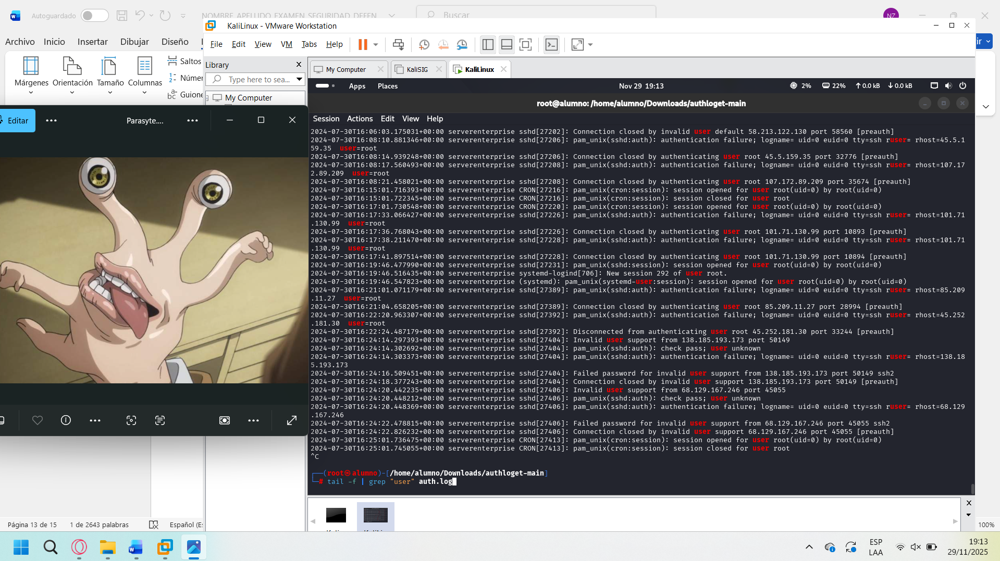

### Análisis en VirusTotal

Se subió la muestra a VirusTotal para análisis estático.

**IOC identificados:**

| Tipo | Valor |
|------|-------|
| MD5 | `db349b97c37d22f5ea1d1841e3c89eb4` |
| SHA1 | `e889544aff85ffaf8b0d0da705105dee7c97fe26` |
| SHA256 | `24d004a104d4d54034dbcffc2a4b19a11f39008a575aa614ea04703480b1022c` |
| Clasificación | Ransom.WanaCrypt0r / Ransomware.WannaCry |
| Detecciones | 67/72 motores antivirus |

**Archivos dropped (IOC adicionales):**
- `b.wnry` - fondo de pantalla de rescate
- `c.wnry` - archivo de configuración del ransomware
- `@WanaDecryptor@.exe.lnk` - acceso directo al decryptor falso

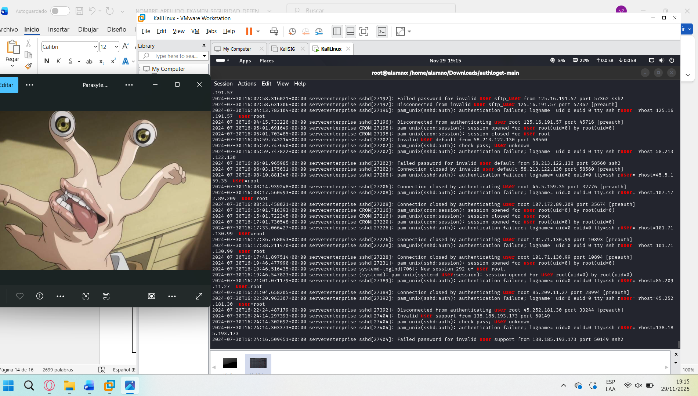
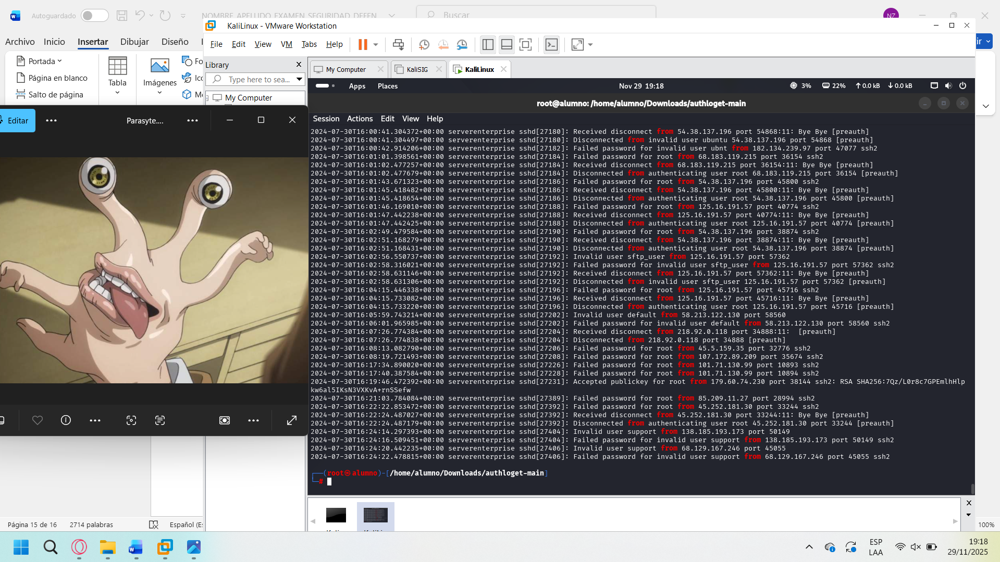

### Análisis dinámico en ANY.RUN

Se ejecutó WannaCry dentro de una VM Windows 10 usando ANY.RUN para observar su comportamiento en tiempo real.

**Resultado:** Clasificado como **100/100 de peligrosidad**.

**Comportamiento observado:**
- Archivos WNRY creados en `AppData\Temp`
- Notas de rescate en múltiples idiomas
- Modificaciones en el registro de Windows
- Más de **1.300 archivos modificados** (cifrados)
- Creación de procesos secundarios
- Múltiples dropped files con hashes SHA256

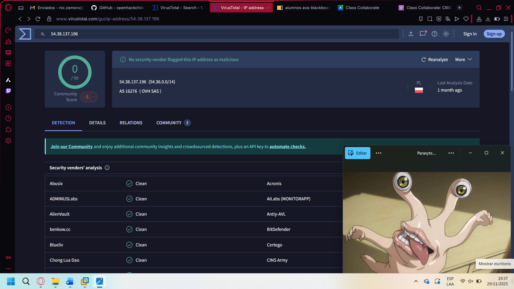
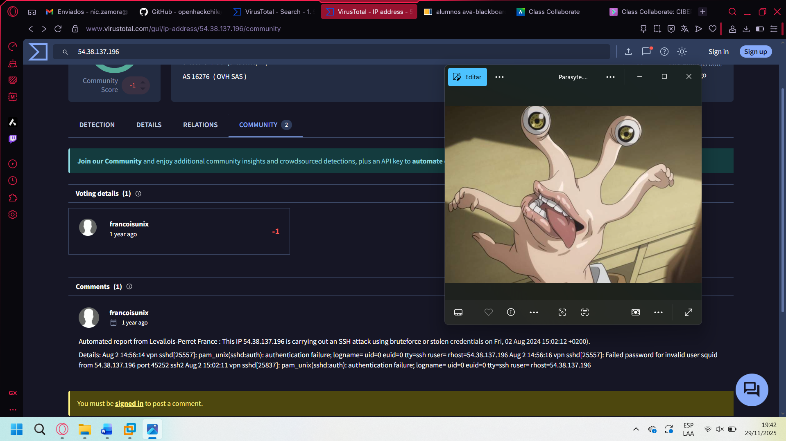

---

## Ítem 4 - Análisis de Archivos de Registro (Logs)

**Contexto:** La empresa detectó actividad inusual en servidores web. Se analizó el archivo `auth.log` para identificar intentos de acceso no autorizados.

```bash
# Clonar repositorio con el log de ejemplo
git clone https://github.com/openhackchile/authloget.git
cd authloget

# Revisar contenido rápido
cat auth.log | head -50
```

### Obtener IPs únicas con intentos fallidos

```bash
grep "Failed password" auth.log | grep -oE "[0-9]+\.[0-9]+\.[0-9]+\.[0-9]+" | sort -u
```

```bash
# Filtro alternativo por campo rhost
grep "rhost" auth.log
```

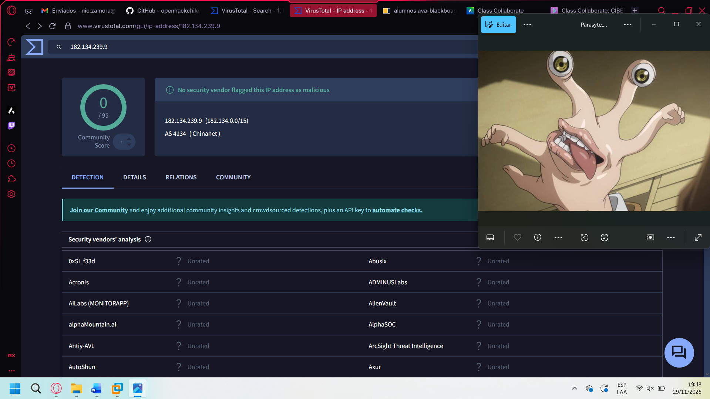

### Obtener usuarios únicos

```bash
grep "user " auth.log | awk '{print $NF}' | sort -u

# Con tail -f en tiempo real
tail -f auth.log | grep "user "
```

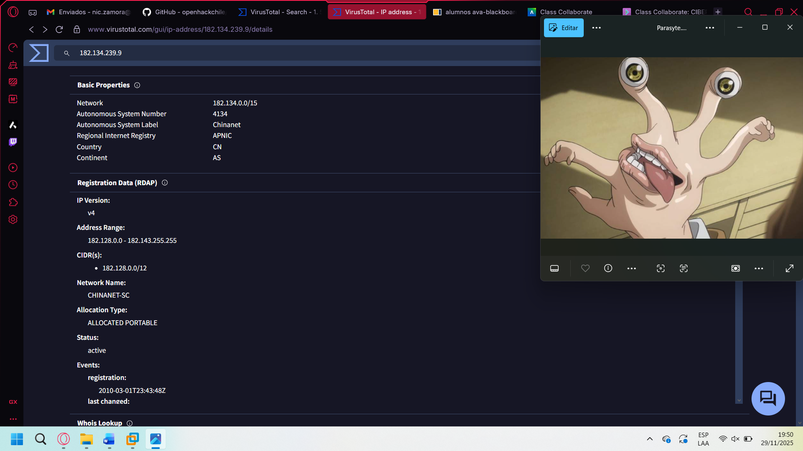

### Análisis de reputación de IPs en VirusTotal

| IP | Reputación | Observaciones |
|----|------------|---------------|
| `54.38.137.196` | Sospechosa | Reportes comunitarios de ataques SSH por fuerza bruta |
| `182.134.239.9` | Sin detecciones | No clasificada como maliciosa |
| `125.16.191.57` | **Maliciosa** | 2 motores detectaron phishing; IP residencial India |
| `218.92.0.118` | **Maliciosa** | 8 motores; malware + phishing; red Chinanet (China) |
| `68.183.119.215` | **Maliciosa** | 8 motores; DigitalOcean VPS usado para fuerza bruta |

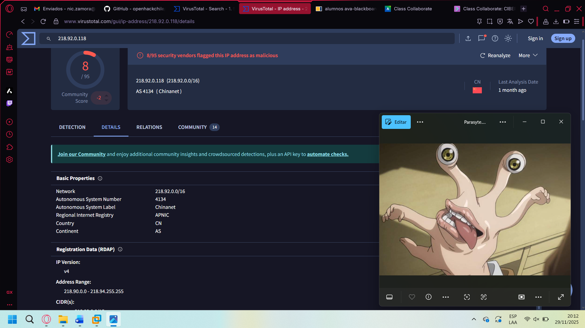

**Conclusión del análisis de logs:** Se identificaron múltiples IPs maliciosas realizando ataques de fuerza bruta SSH contra el servidor. Las IPs chinas y las asociadas a proveedores cloud baratos (`DigitalOcean`) son las más frecuentes en este tipo de campañas.

---

## Ítem 5 - Implementación de SIEM usando Wazuh

**Contexto:** La empresa decidió implementar Wazuh como plataforma SIEM para mejorar la detección y respuesta a incidentes.

### Arquitectura implementada

```
VM 1: CentOS 10 - Wazuh Server (4GB RAM, 2 interfaces)
  - Wazuh Manager
  - Wazuh Indexer  
  - Wazuh Dashboard

VM 2: Kali Linux - Agente Linux (Red NAT)

Física: Windows 11 - Agente Windows
```

### Instalación en CentOS 10

```bash
# Script de instalación oficial Wazuh
curl -sO https://packages.wazuh.com/4.x/wazuh-install.sh
bash wazuh-install.sh -a

# Verificar IP del servidor
ip addr show
```

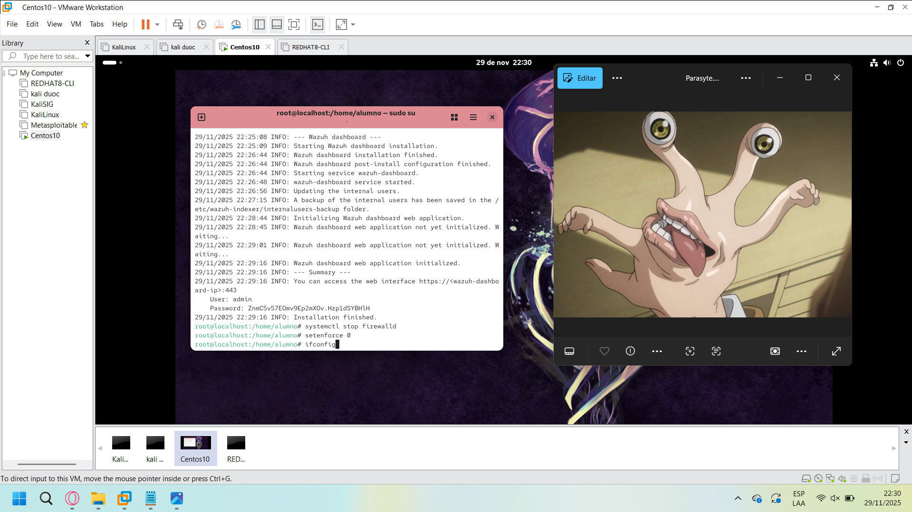
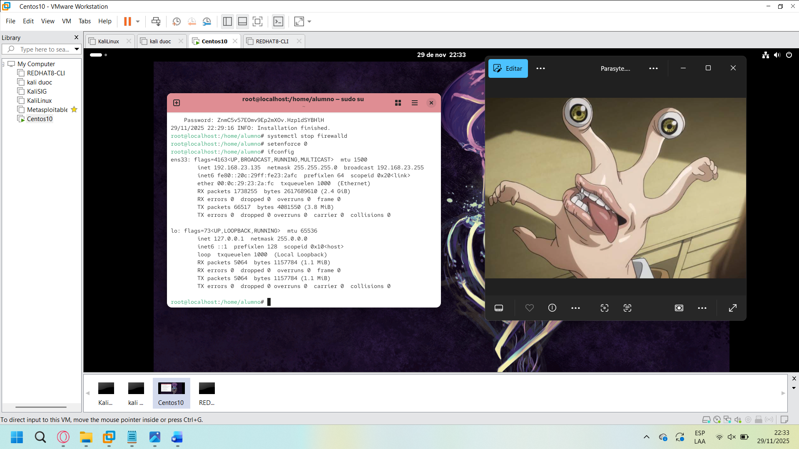

### Agente en Windows 11 (máquina física)

1. Descargar instalador MSI desde la consola Wazuh
2. Ejecutar con el token de registro
3. Iniciar el servicio `wazuh-agent`

```powershell
# En PowerShell (Windows)
Start-Service WazuhSvc
```

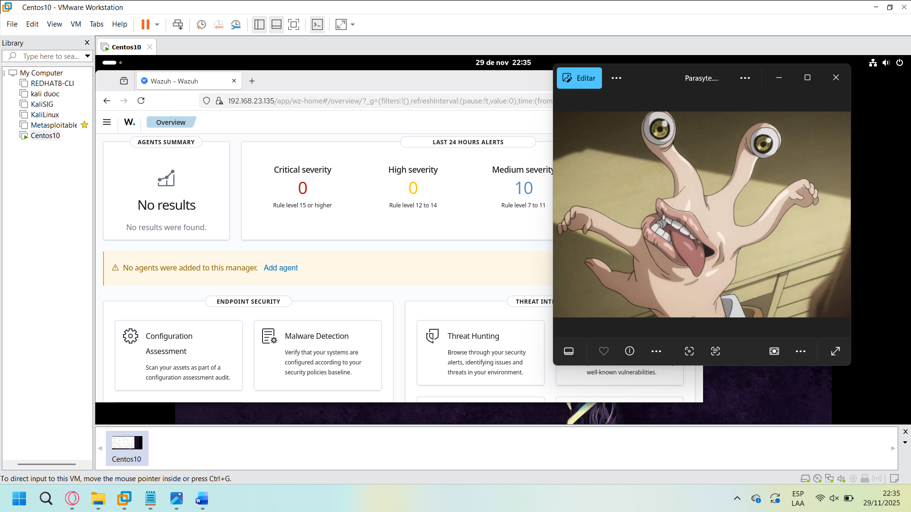
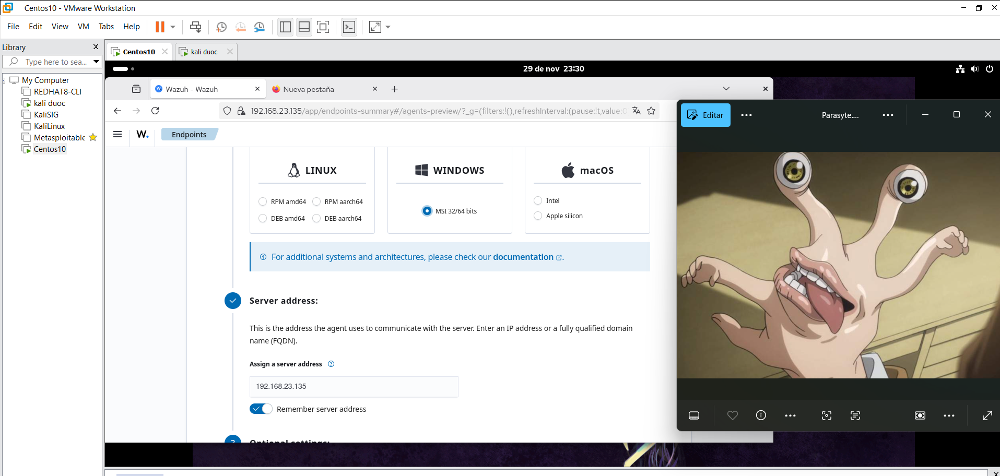
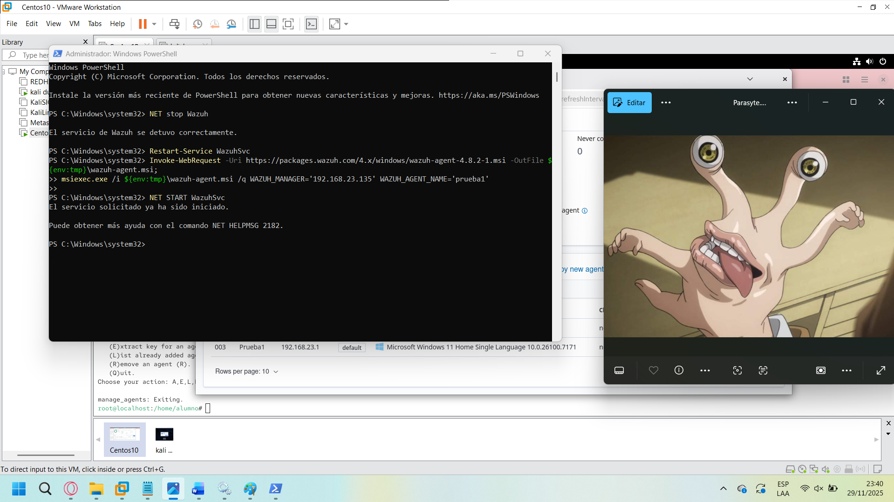

### Agente en Kali Linux

```bash
# Agregar repositorio Wazuh (Debian/Kali)
curl -s https://packages.wazuh.com/key/GPG-KEY-WAZUH | apt-key add -
echo "deb https://packages.wazuh.com/4.x/apt/ stable main" | \
  tee /etc/apt/sources.list.d/wazuh.list

apt-get update && apt-get install wazuh-agent

# Registrar con el servidor
WAZUH_MANAGER="192.168.x.x" WAZUH_AGENT_NAME="kali-lab" \
  dpkg-reconfigure wazuh-agent

# Iniciar servicio
systemctl start wazuh-agent
systemctl enable wazuh-agent
```


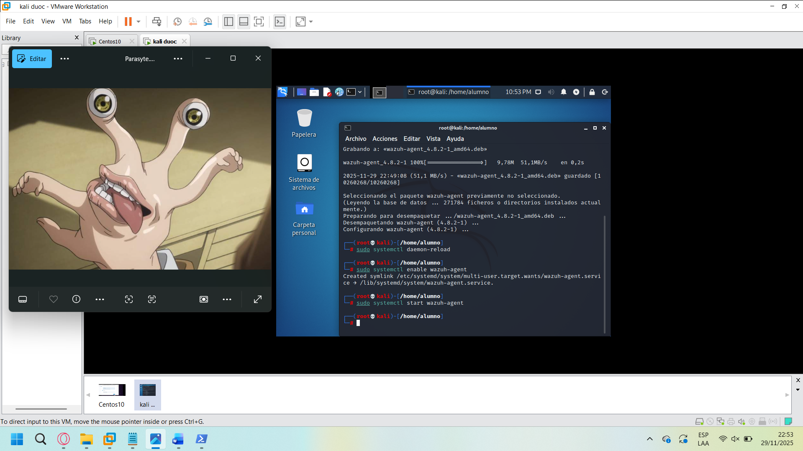
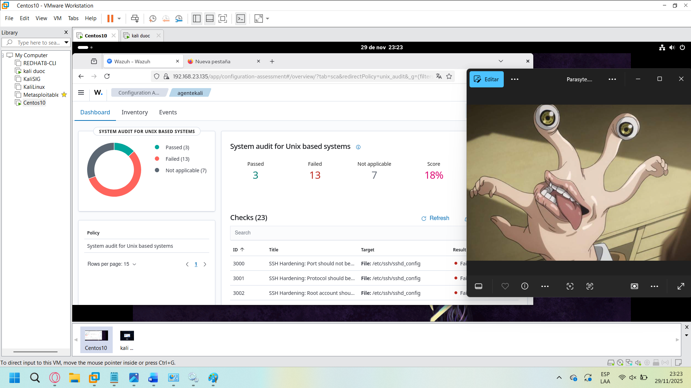

---

## Conclusión

A través de este examen y del ramo en general, quedó demostrado que es posible desarrollar, a nivel básico pero sólido, casi todo el flujo de trabajo que realiza un SOC real. Desde la captura y análisis de tráfico con Wireshark y TCPDump, hasta la identificación de IOC en plataformas como ANY.RUN y VirusTotal, se aplicaron metodologías fundamentales para entender el ciclo completo de detección, análisis y respuesta.

También se integraron capacidades de investigación en logs como `auth.log` junto con el uso de expresiones regulares, clasificación de alertas y revisión de reputación de IPs, lo que permitió tener una visión inicial de cómo opera un analista N1 y cómo se apoya en herramientas SIEM como Wazuh para correlacionar eventos y levantar incidentes.

> *"Este ramo me prendió aún más el interés por la ciberseguridad. Todo lo que hicimos - la parte técnica, práctica, equivocarse, probar de nuevo - se sintió como un desafío entretenido y súper dinámico."* - Nicolás Zamora
