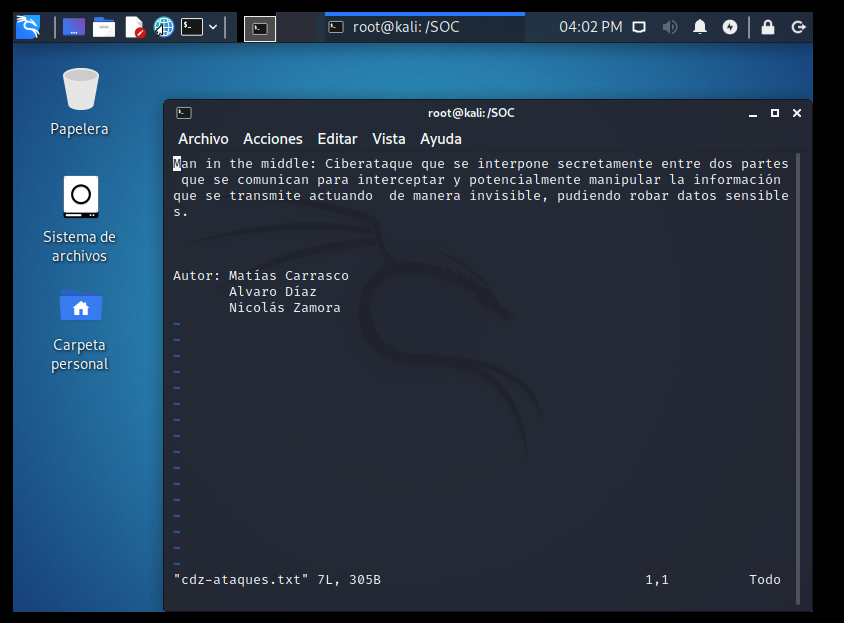
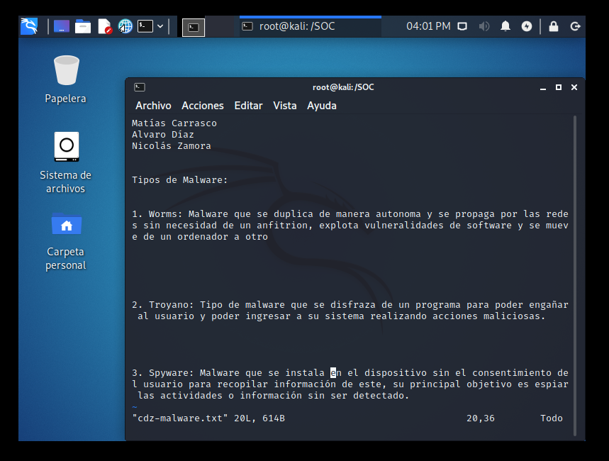
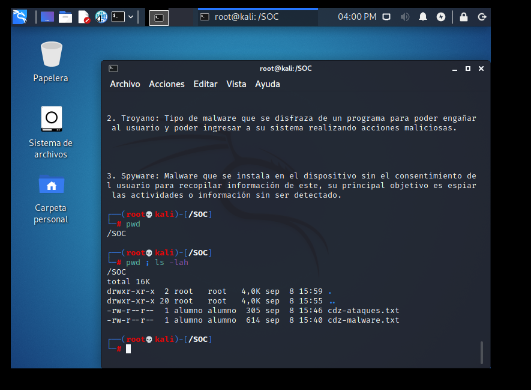
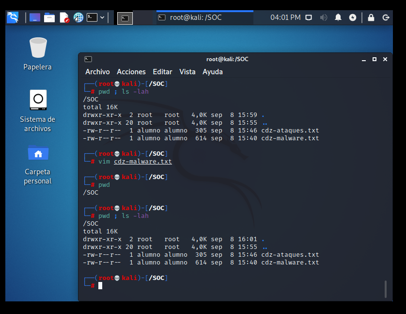
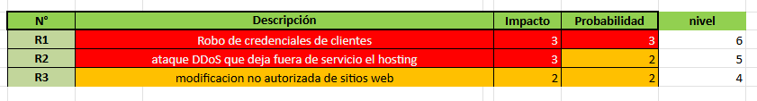
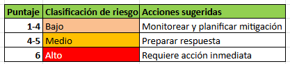
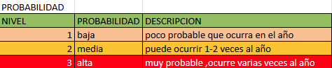
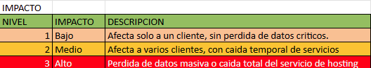

# Informe — Lab 01: Fundamentos SOC

**Laboratorio 1**  
**Autor:** Nicolás Zamora  
**Fecha:** 08-09-2025

---

## Pregunta 1 — ¿Qué es un SOC y qué niveles existen? (3 pts)

Un **SOC (Security Operations Center)** es un centro de operaciones encargado de la seguridad, donde se monitorean y detectan ataques, se previenen incidentes y se responde a ellos en tiempo real.

### Niveles del SOC

| Nivel | Función |
|-------|---------|
| **N1** | Monitoreo: revisiones iniciales de alertas y eventos de seguridad |
| **N2** | Análisis, validación, correlación y priorización de incidentes |
| **N3** | Respuesta: investigación avanzada, mitigación y recuperación |
| **N4** | Gestión y estrategia: coordinación, políticas y mejora continua |

---

## Pregunta 2 — ¿Qué es un SIEM? (3 pts)

El **SIEM (Security Information and Event Management)** es la plataforma que recopila y correlaciona los logs de múltiples sistemas para identificar amenazas. Es la herramienta central que utilizan los SOC para centralizar la visibilidad de eventos de seguridad.

---

## Pregunta 3 — Política de Seguridad: Confidencialidad de la Información (empresa de hosting) (3 pts)

**Objetivo:** Proteger la información de los clientes y de la empresa para asegurar que sea de uso exclusivo por el personal autorizado.

**Alcance:** Aplica a todos los trabajadores con acceso autorizado, así como a las bases de datos y respaldos de los sitios web de los clientes. Se implementa cifrado de extremo a extremo, privilegios mínimos y registros de auditoría.

**Responsable:** Analistas SOC en los 4 niveles.

**Sanciones:** En caso de divulgar credenciales de autorización intencionalmente, se realizará inmediatamente el término del contrato.

---

## Pregunta 4 — Matriz de Riesgo: Tablas de Impacto y Probabilidad (3 pts)

### Tabla de Impacto

| Nivel | Descripción |
|-------|-------------|
| **Alto** | Pérdida total de datos del cliente / caída del servicio |
| **Medio** | Degradación parcial del servicio / fuga controlada |
| **Bajo** | Incidente menor sin impacto operacional significativo |

### Tabla de Probabilidad

| Nivel | Descripción |
|-------|-------------|
| **Alta** | El ataque es frecuente y el sistema está expuesto |
| **Media** | El ataque ocurre ocasionalmente con controles básicos |
| **Baja** | El ataque es poco probable dado el nivel de protección actual |




---

## Pregunta 5 — Clasificación de 3 Riesgos (CIA) — Hosting de Sitios Web (3 pts)

### Matriz de Riesgo



### Tabla de Riesgos Clasificados

| Riesgo | Pilar CIA | Impacto | Probabilidad |
|--------|-----------|---------|--------------|
| Filtración de credenciales de clientes | **Confidencialidad** | Alto | Media |
| Modificación no autorizada de contenido web | **Integridad** | Alto | Media |
| Caída del servicio por ataque DDoS | **Disponibilidad** | Alto | Alta |



---

## Pregunta 6 — Playbook: Ataque DDoS / Fuerza Bruta al Hosting (3 pts)

```
PLAYBOOK — Respuesta a Ataque DDoS / Fuerza Bruta
```

### 1. Identificar el Problema
- Sobrecargas en el sitio web con caídas frecuentes
- Múltiples intentos de login fallidos
- Usar logs del servidor para analizar el tráfico

### 2. Contener el Problema
- Eliminar IPs sospechosas para bajar la carga
- Activar contención de DDoS con Cloudflare o AWS Shield

### 3. Eliminar el Problema
- Eliminar exhaustivamente IPs sospechosas
- Redirigir IP al servidor de respaldo
- Mantener últimas versiones de seguridad en todos los servidores

### 4. Recuperación
- Reiniciar los servidores una vez mitigado el ataque
- Revisar la integridad de los datos de las páginas web
- Asegurarse de que el sistema de alertas esté funcionando correctamente

### 5. Lecciones Aprendidas
- Documentar el ataque
- Analizar lo ocurrido para mejorar los firewalls
- Actualizar los planes de contingencia frente a ataques DDoS
- Capacitar al SOC para mejorar la respuesta

---

## Pregunta 7 — Playbook: Troyano en el Hosting (3 pts)

```
PLAYBOOK — Respuesta a Infección por Troyano
```

### 1. Identificar el Problema
- Archivos externos detectados en los servidores
- Alertas del antivirus en los servidores
- Monitoreo constante de archivos para identificar anomalías

### 2. Contener el Problema
- Apagar temporalmente los servicios infectados para evitar propagación
- Bloquear IPs o dominios sospechosos

### 3. Eliminar el Problema
- Escanear el servidor completo para detectar archivos infectados
- Restaurar desde backups limpios
- Actualizar software para eliminar vulnerabilidades explotadas

### 4. Recuperación
- Revisar archivos y bases de datos para verificar integridad
- Reiniciar los servidores para asegurar la limpieza
- Monitoreo exhaustivo durante la primera semana post-incidente

### 5. Lecciones Aprendidas
- Documentar el ataque
- Capacitar al SOC para mejorar la respuesta
- Actualizar planes de contingencia frente a troyanos

---

## Pregunta 8 — Laboratorio Linux: Directorio SOC y archivo de malware (3 pts)

```bash
mkdir /SOC
vim /SOC/nz-malware.txt
```

**Contenido del archivo:**

```
Nombre: Nicolás Zamora

MALWARE IDENTIFICADOS:

Troyano: Programa malicioso que se disfraza de software legítimo para engañar al usuario
y permitir acceso remoto no autorizado al sistema, pudiendo robar información.

Ransomware: Tipo de malware que cifra los archivos del sistema de la víctima y exige
un pago (rescate) para proporcionar la clave de descifrado y recuperar el acceso.

Spyware: Software que se instala silenciosamente en un dispositivo para recopilar
información del usuario sin su conocimiento, enviándola a terceros maliciosos.
```




---

## Pregunta 9 — Laboratorio Linux: archivo de ataques (3 pts)

```bash
vim /SOC/nz-ataques.txt
```

**Contenido del archivo:**

```
DDoS (Distributed Denial of Service): Ataque en el que múltiples equipos comprometidos
envían tráfico masivo a un servidor objetivo para saturarlo y dejarlo sin servicio,
impidiendo el acceso a usuarios legítimos.

Autor: Nicolás Zamora
```



