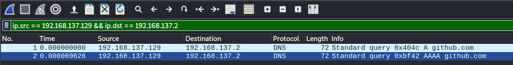
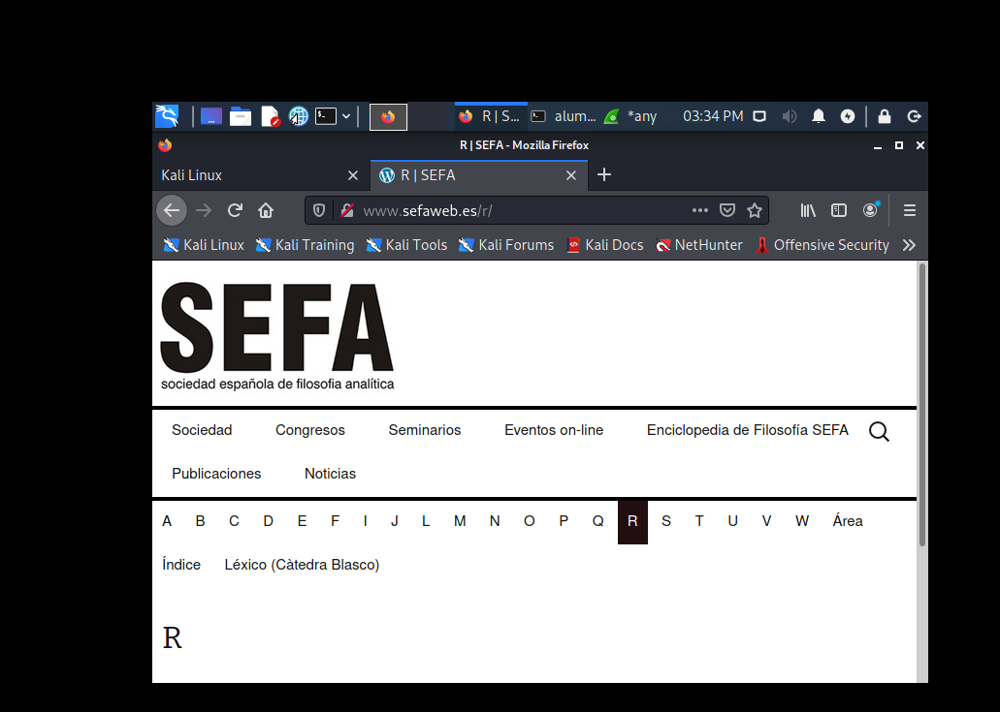
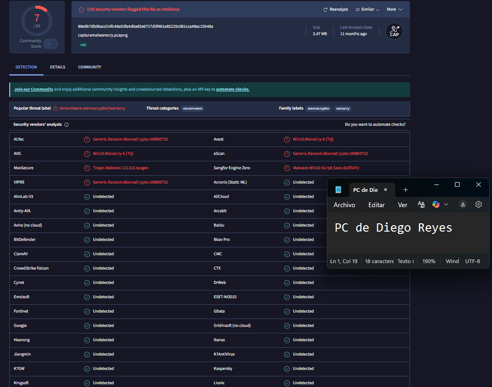
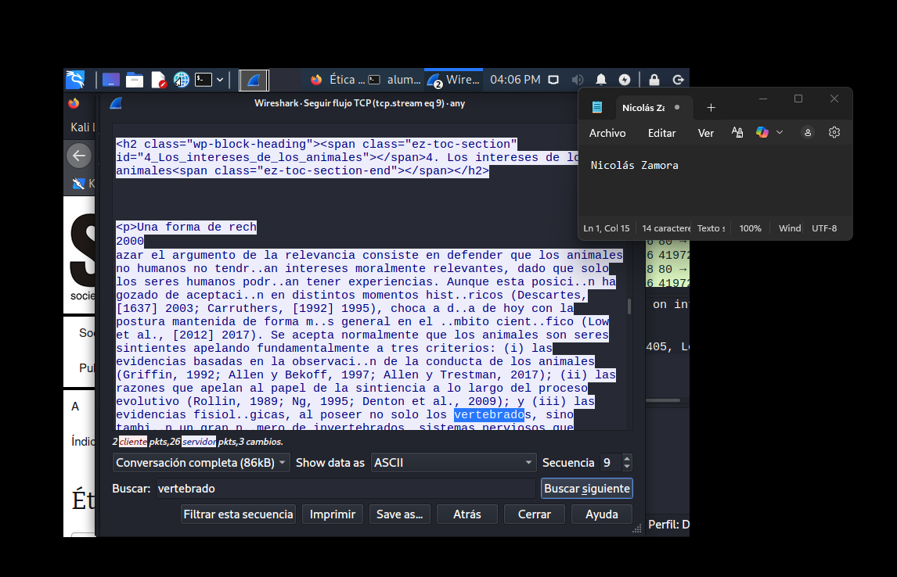
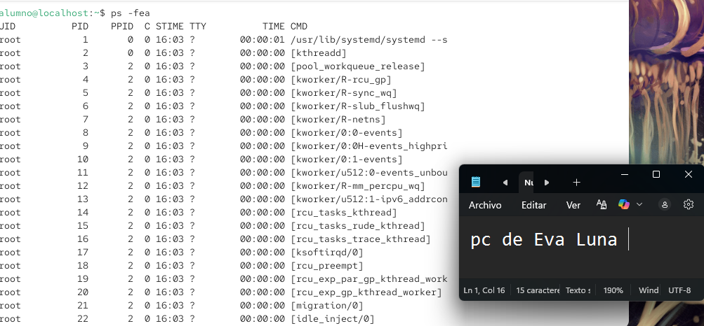
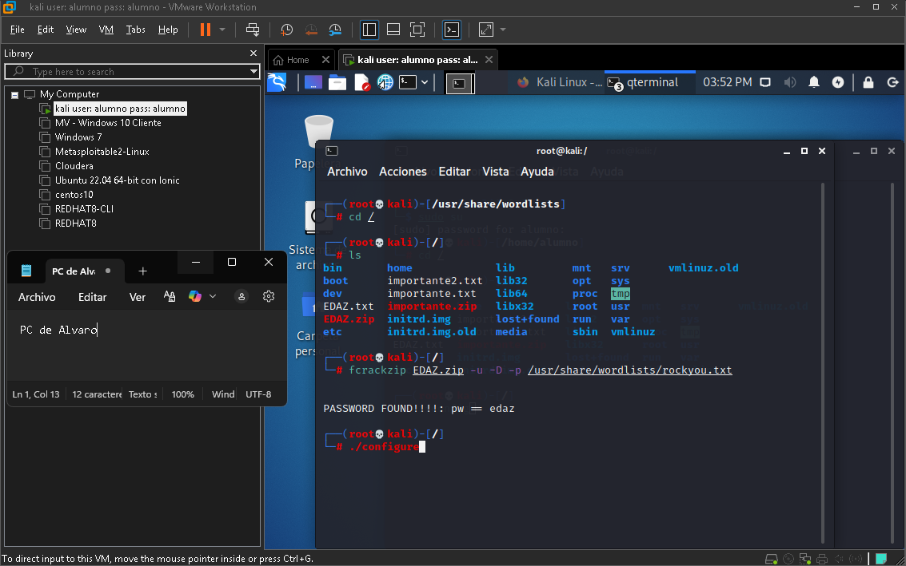
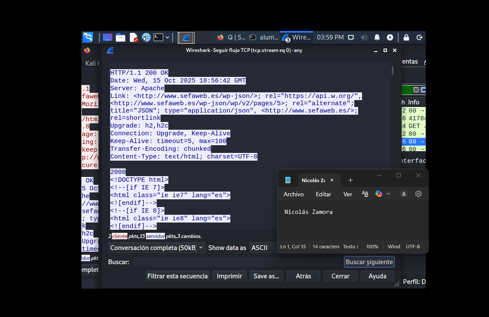
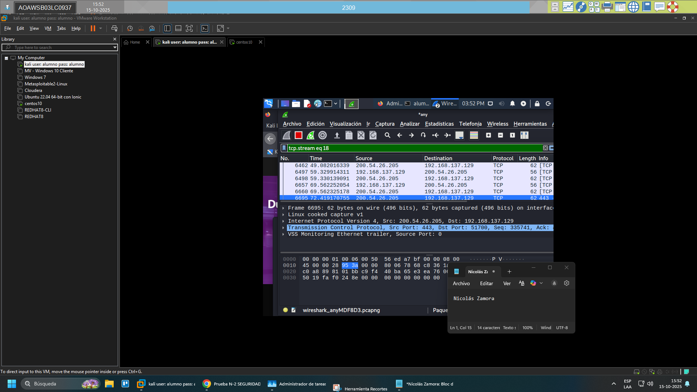
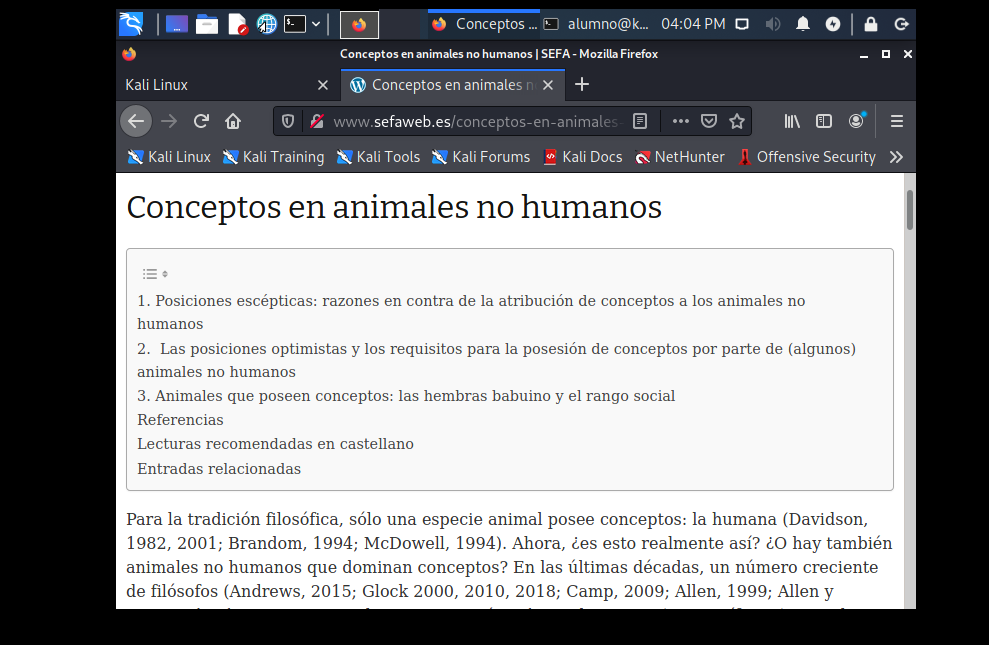
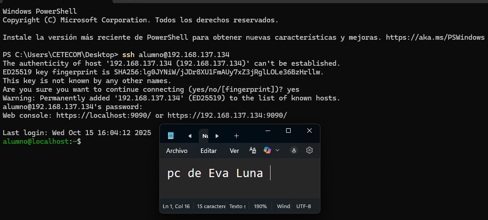

# Informe - Lab 02: Análisis de Tráfico con Wireshark

**Laboratorio 2**  
**Autor:** Nicolás Zamora  
**Fecha:** 15-10-2025  
**Asignatura:** Ciberseguridad Defensiva

> Cada captura incluye una imagen personalizada del equipo como prueba de autoría.

---

## Ejercicio 1 - Captura de Tráfico HTTP con Wireshark (3 pts)

**Objetivo:** Capturar tráfico desde Kali Linux mientras se navega en sitios sin seguridad (HTTP). Se usó el filtro de Google `nurl:http -inurl:https animales` para encontrar páginas HTTP y se buscó "Vertebrado".

### Resultado
- Página HTTP seleccionada: sitio con información sobre vertebrados
- Wireshark capturó los paquetes sin cifrar de la búsqueda




---

## Ejercicio 2 - HTTP vs HTTPS: Seguimiento de Trama y Diferencias (3 pts)

**Objetivo:** Comparar el tráfico capturado de un sitio HTTP contra uno HTTPS e identificar las diferencias.

### Sitio HTTP - Paquetes sin cifrar
El tráfico viaja en texto plano. Es posible aplicar filtros para capturar datos específicos como contraseñas, nombres de usuario, formularios, etc.



### Sitio HTTPS - Paquetes cifrados
Todo el contenido va cifrado mediante TLS. Wireshark solo muestra los metadatos del protocolo, no el contenido de los paquetes.



### Diferencia clave
> **HTTP:** Tráfico visible → riesgo de intercepción de credenciales y datos sensibles.  
> **HTTPS:** Tráfico cifrado con TLS → protegido contra ataques de tipo Man-in-the-Middle.

---

## Ejercicio 3 - Análisis de Malware WannaCry en VirusTotal (3 pts)

**Objetivo:** Descargar el archivo de captura del malware WannaCry, subirlo a VirusTotal e identificar sus IOC.

**Repositorio fuente:** `https://github.com/openhackchile/capturamalwarecry.git`

```bash
git clone https://github.com/openhackchile/capturamalwarecry.git
cd capturamalwarecry
```

Se descargó el archivo de captura (.pcap) y se subió a VirusTotal para análisis.

### IOC Identificados en VirusTotal

| Tipo de IOC | Valor |
|-------------|-------|
| Hash MD5 | `db349b97c37d22f5ea1d1841e3c89eb4` |
| Hash SHA1 | `e889544aff85ffaf8b0d0da705105dee7c97fe26` |
| Hash SHA256 | `24d004a104d4d54034dbcffc2a4b19a11f39008a575aa614ea04703480b1022c` |
| Clasificación | Ransomware.WannaCry / Ransom.WanaCrypt0r |
| Detecciones | 67/72 motores antivirus |




---

## Ejercicio 4 - Filtros Wireshark por IP Origen y Destino (3 pts)

**Objetivo:** Aplicar un filtro de Wireshark que combine IP de origen e IP de destino en una sola expresión.

```
Filtro aplicado:
ip.src == 192.168.x.x && ip.dst == 192.168.x.x
```

Se identificaron los paquetes del malware WannaCry entre los hosts de la captura y se filtró el tráfico por las IPs involucradas.



---

## Ejercicio 5 - Cracking de Contraseña ZIP con fcrackzip (3 pts)

**Objetivo:** Comprimir un archivo `.txt` con texto de muestra, protegerlo con una contraseña y luego romperla usando `fcrackzip` con diccionario.

```bash
# Crear el archivo
echo "Nicolás Zamora" > nz.txt

# Comprimir con contraseña
zip -e nz.zip nz.txt

# Ataque de diccionario con rockyou
fcrackzip -u -D -p /usr/share/wordlists/rockyou.txt nz.zip
```

### Resultado
`fcrackzip` encontró la contraseña usando el diccionario rockyou.txt.




---

## Ejercicio 6 - Conexión SSH y Gestión de Procesos (3 pts)

**Objetivo:** Establecer conexión SSH desde Windows a CentOS 10, identificar el proceso y terminarlo.

```bash
# Desde Windows (PowerShell o PuTTY)
ssh usuario@192.168.23.x

# Identificar el proceso SSH en CentOS 10
ps aux | grep sshd
# o
netstat -tnp | grep :22

# Matar el proceso por PID
kill -9 <PID>
```




---

## Ejercicio 7 - Análisis de Logs del Sistema (3 pts)

**Comando analizado:**
```bash
tail -n 30 /var/log/messages
```

**Descripción:**  
Este comando muestra las últimas 30 líneas del archivo de log `/var/log/messages`, el cual registra alertas, resultados, errores del sistema y eventos de arranque. Es una herramienta fundamental para el monitoreo y diagnóstico en sistemas Linux (especialmente distribuciones basadas en Red Hat como CentOS).

**Uso típico en SOC:** Permite revisar rápidamente los últimos eventos del sistema sin abrir el archivo completo, útil para detectar errores recientes o actividad sospechosa.
