# Informe — Lab 03: Wazuh SIEM + Suricata IDS

**Laboratorio 3**  
**Autor:** Nicolás Zamora  
**Fecha:** 19-11-2025

---

## Ejercicio 1 — Instalación de Wazuh en CentOS 10 (3 pts)

Se instaló la plataforma Wazuh completa en CentOS 10, incluyendo:
- **Wazuh Manager** — servidor central de gestión
- **Wazuh Indexer** — almacenamiento y búsqueda de eventos (OpenSearch)
- **Wazuh Dashboard** — interfaz web de visualización

La instalación se realizó usando el script oficial de Wazuh:

```bash
curl -sO https://packages.wazuh.com/4.x/wazuh-install.sh
bash wazuh-install.sh -a
```

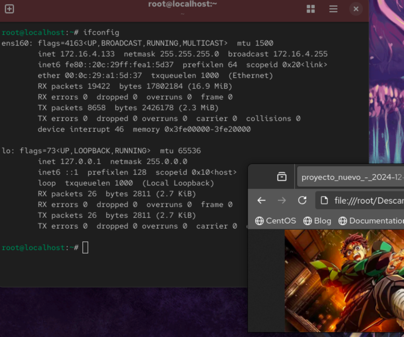

---

## Ejercicio 2 — Agente Wazuh en Windows (3 pts)

Se configuró el agente Wazuh en un sistema Windows 10 para que reportara al servidor en CentOS 10.

**Configuración del agente (ossec.conf):**
```xml
<server>
  <address>192.168.23.x</address>
  <port>1514</port>
  <protocol>tcp</protocol>
</server>
```

> **Nota:** El agente fue configurado correctamente en Windows, pero no se visualizó en la consola web de Wazuh al momento de la captura.

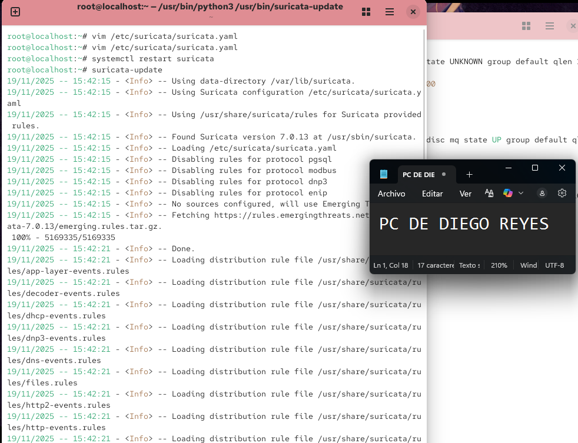

---

## Ejercicio 3 — Agente Wazuh en Kali Linux (3 pts)

Se instaló y registró el agente Wazuh en Kali Linux exitosamente.

```bash
# En Kali Linux — instalación del agente
curl -s https://packages.wazuh.com/key/GPG-KEY-WAZUH | apt-key add -
echo "deb https://packages.wazuh.com/4.x/apt/ stable main" | tee /etc/apt/sources.list.d/wazuh.list
apt-get update && apt-get install wazuh-agent

# Registrar el agente con el servidor
/var/ossec/bin/agent-auth -m 192.168.23.x

# Iniciar el agente
systemctl start wazuh-agent
systemctl enable wazuh-agent
```

El agente de Kali Linux aparece correctamente registrado y activo en la consola web de Wazuh.

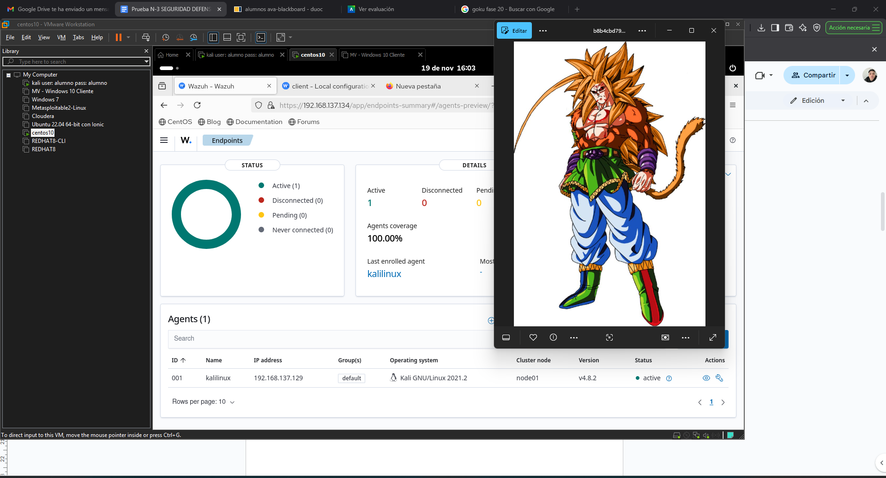
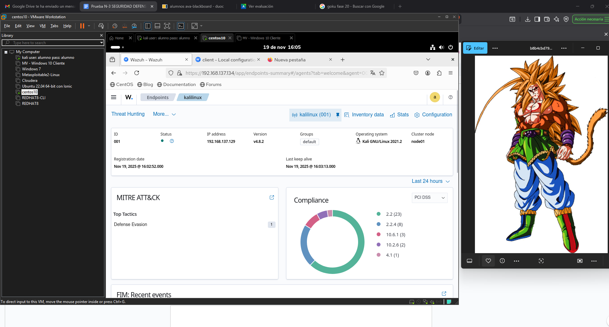

---

## Ejercicio 4 — Configuración de Suricata IDS (3 pts)

Se instaló y configuró **Suricata** como NIDS (Network Intrusion Detection System) en CentOS 10, adaptando la configuración a la interfaz de red real del servidor.

### Problema encontrado y solución
El archivo de configuración de Suricata referenciaba `eth0`, pero la interfaz real del servidor era `ens160`.

```bash
# Editar la configuración con vim (modo de comandos)
vim /etc/suricata/suricata.yaml

# En modo comando de vim, reemplazar globalmente:
:%s/eth0/ens160/g
```

```bash
# Reiniciar Suricata para aplicar cambios
systemctl restart suricata
systemctl status suricata
```

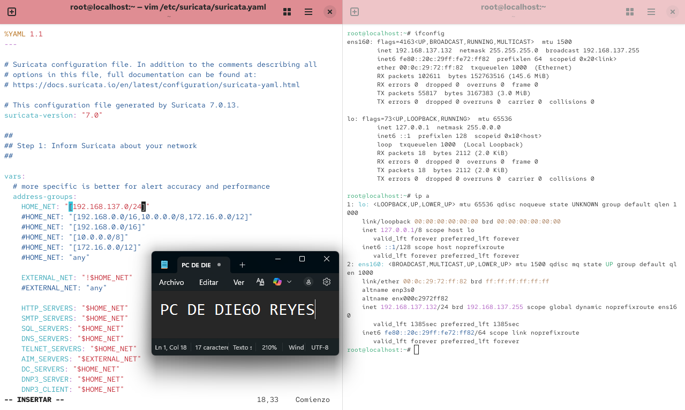
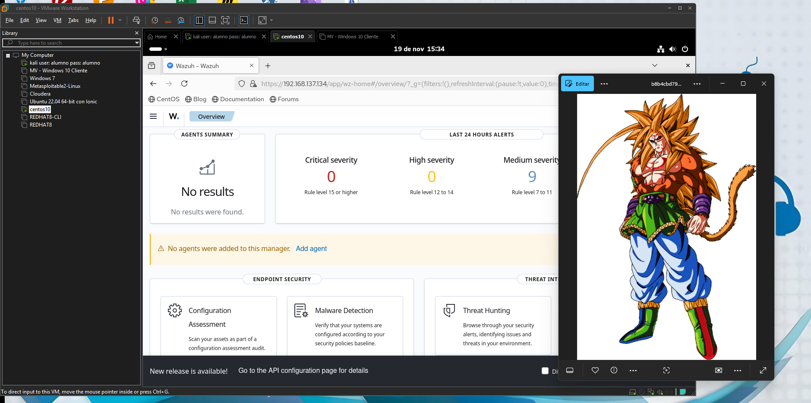

---

## Ejercicio 5 — Simulación de Ataque y Detección en Suricata (3 pts)

Se generó tráfico malicioso (curl a un sitio web externo) para verificar que Suricata lo registrara en sus logs.

```bash
# Generar tráfico malicioso desde Kali
curl http://testmyids.com

# Verificar logs de Suricata en CentOS 10
tail -f /var/log/suricata/eve.json | grep "alert"
```

**Resultado:** Suricata detectó y registró el tráfico en formato JSON (eve.json), mostrando el tipo de alerta, IP origen, IP destino, protocolo y timestamp.

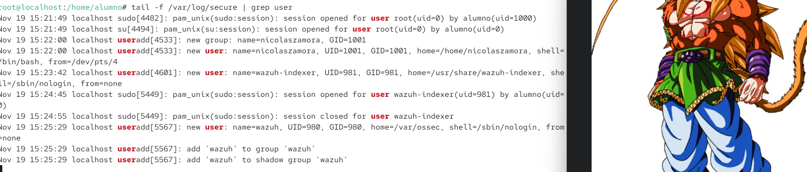
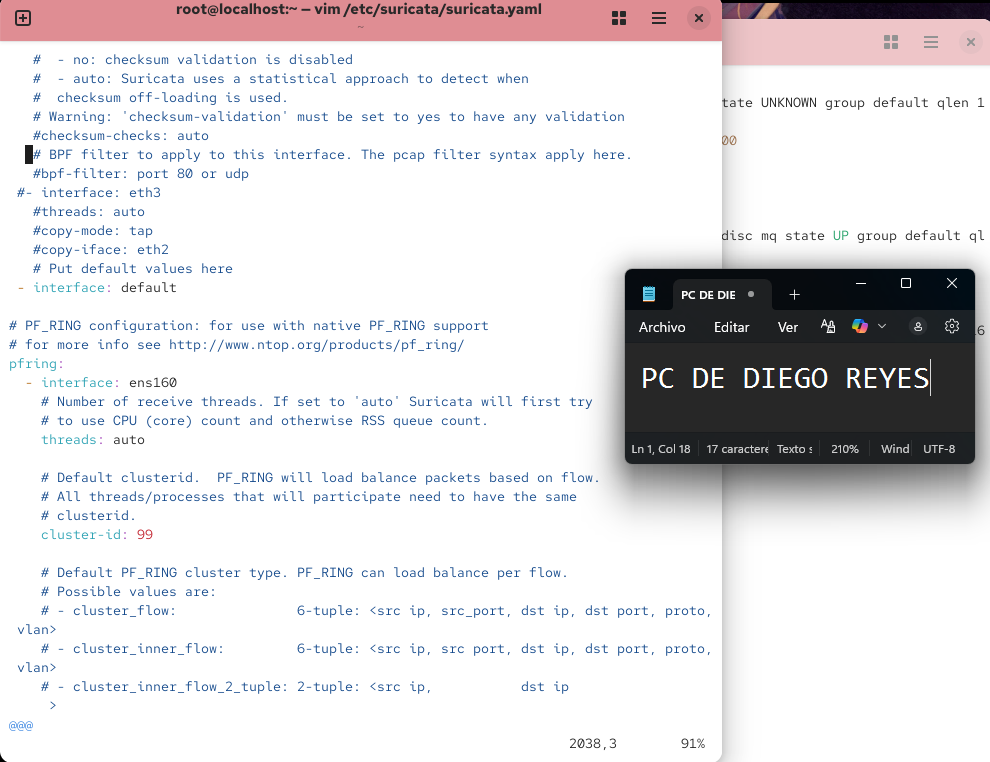

---

## Ejercicio 6 — Creación de Usuario y Auditoría de Acceso (3 pts)

Se creó un usuario en CentOS 10 y se verificó su registro en los logs del sistema.

```bash
# En CentOS 10
useradd nicolaszamora
passwd nicolaszamora
# Contraseña asignada: 204669295nicolas

# Verificar en logs de seguridad
tail -f /var/log/secure
```

Los logs de `/var/log/secure` mostraron:
- La creación del usuario `nicolaszamora`
- La asignación de contraseña
- El acceso al sistema con el nuevo usuario

```bash
# Búsqueda específica de eventos del usuario
grep "nicolaszamora" /var/log/secure
```

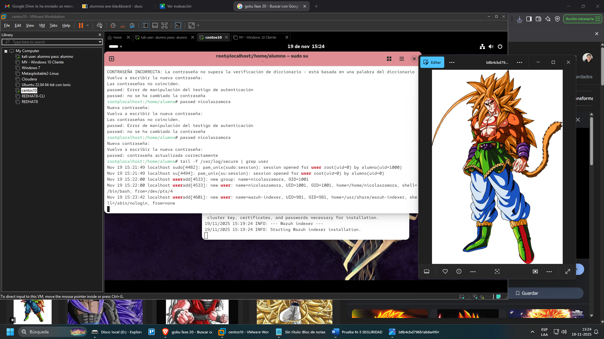
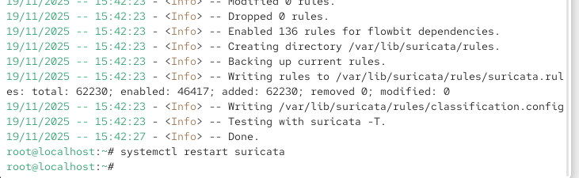
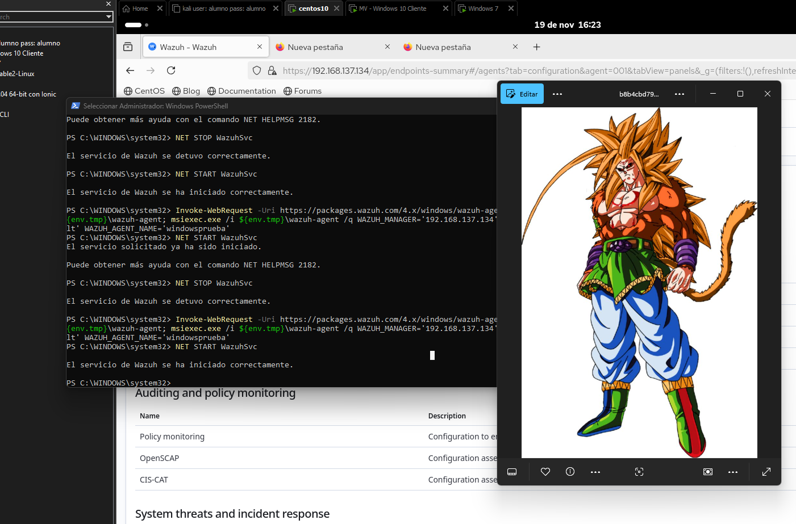

---

## Ejercicio 7 — Definición de Conceptos (3 pts)

### IOC (Indicators of Compromise)
Los indicadores de compromiso son pistas o artefactos que sugieren que una red o sistema ha sido comprometido por una amenaza cibernética (malware o filtración de datos). Pueden incluir comportamientos inusuales como tráfico de red anómalo, inicios de sesión desde ubicaciones extrañas, o la presencia de archivos y procesos sospechosos. Utilizar IOC ayuda a los equipos a detectar actividades maliciosas, identificar violaciones y responder rápidamente a los incidentes.

### HIDS (Host-based Intrusion Detection System)
Es una solución de ciberseguridad que se instala en un sistema individual (como un servidor o estación de trabajo) para monitorear su actividad y detectar signos de actividad sospechosa. Analiza archivos de registro, procesos y otras actividades del sistema para identificar intentos de ataque, accesos no autorizados o modificaciones de archivos.

### Proceso de Gestión de Alertas
El proceso de gestión de alertas implica recibir, evaluar, priorizar, responder y supervisar las notificaciones generadas por sistemas de seguridad o TI. Su objetivo principal es mitigar amenazas y resolver incidentes de manera eficiente, evitando la saturación de los equipos y asegurando que los problemas críticos no se ignoren.
