# Informe - Examen Final: Ciberseguridad en S.O. y Redes

**Caso:** TechInnovate  
**Asignatura:** Ciberseguridad en Sistemas Operativos y Redes · CIBERSEGURIDAD SISTEMA OPERATIVO Y REDES_001D  
**Alumno:** Nicolás Zamora · nic.zamora@duocuc.cl  
**Profesor:** Claudio Rojas  
**Fecha de entrega:** 03-12-2025

---

## Ítem 1 - Direccionamiento IPv4

### Parámetros del equipo anfitrión (Kali Linux)

| Parámetro | Valor |
|-----------|-------|
| Dirección de red | `192.168.23.0` |
| Dirección IPv4 | `192.168.23.133` |
| Máscara de subred | `255.255.255.0` |
| Puerta de enlace | `192.168.23.2` |

**Clase de IP:** Clase C - el primer octeto (192) está en el rango 192–223, correspondiente a redes pequeñas y privadas (192.168.x.x).

```bash
ip addr show
# o
ifconfig
```

Tanto Kali Linux como CentOS comienzan con 192, confirmando que están en la misma red Clase C y pueden comunicarse entre sí.

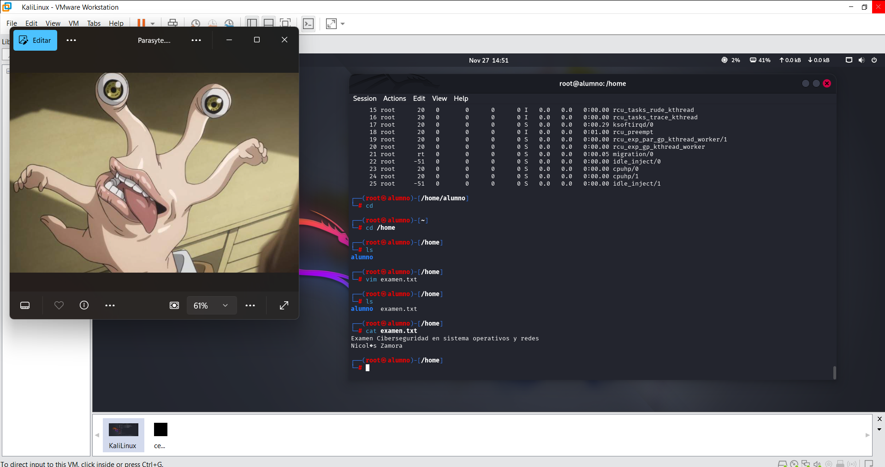

---

## Ítem 2 - Direccionamiento IPv6

> La VM no tenía IPv6 nativo, por lo que se configuró un entorno en **Cisco Packet Tracer**.

### Configuración del entorno (Router + Switch + PC)

**Topología:** Router → Switch → PC

**Paso 1: Configurar el router con IPv6 global unicast**
```
Router(config)# ipv6 unicast-routing
Router(config)# interface GigabitEthernet0/0
Router(config-if)# ipv6 address 2001:DB8:1:0::1/64
Router(config-if)# no shutdown
```

**Paso 2: Activar autoconfiguración IPv6 en el PC**  
El PC recibe los Router Advertisements (RA) y se autoconfigura mediante SLAAC.

### Resultado obtenido

| Parámetro | Valor |
|-----------|-------|
| Porción de red | `2001:DB8:1:0::/64` |
| Dirección IPv6 del host | `2001:DB8:1:0:201:97FF:FE8A:6C23` |
| Prefijo | `/64` |
| Puerta de enlace IPv6 | `FE80::201:C9FF:FE5E:7401` |

**Tipos de direcciones obtenidos:**
- **Link-local** (generada automáticamente): `FE80::201:97FF:FE8A:6C23`
- **Unicast global** (dentro de la red configurada): `2001:DB8:1:0:201:97FF:FE8A:6C23`

### Diferencia entre la dirección IPv6 y la puerta de enlace

La dirección IPv6 del equipo usa una porción de red **global unicast** (`2001:DB8:1:0::/64`), que sirve para comunicarse fuera de la red local. En cambio, la puerta de enlace usa una dirección **link-local** (`FE80::/64`), ya que en IPv6 los routers anuncian su presencia y funcionan como gateway usando direcciones link-local. Esto significa que el host y su gateway operan en prefijos de red completamente distintos.

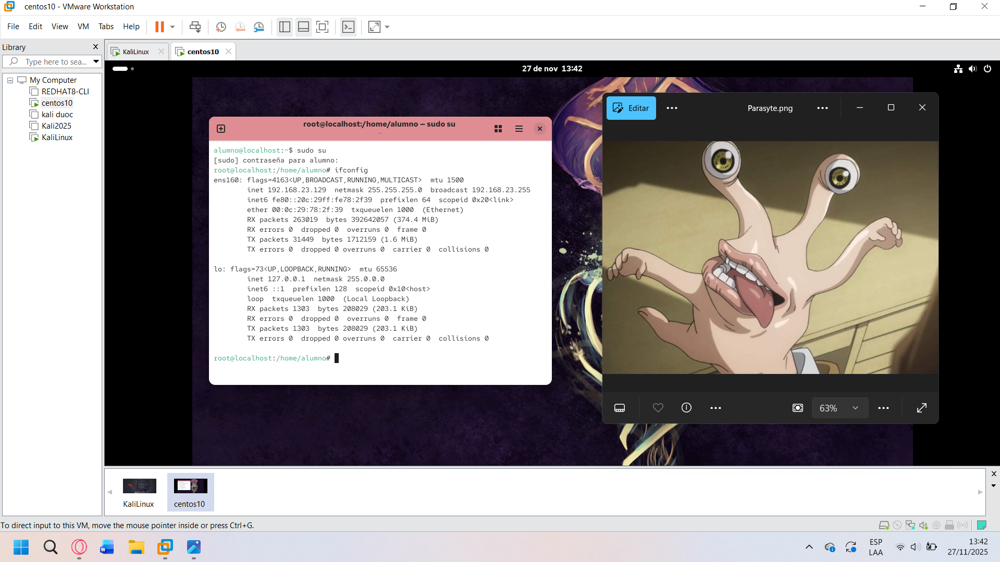
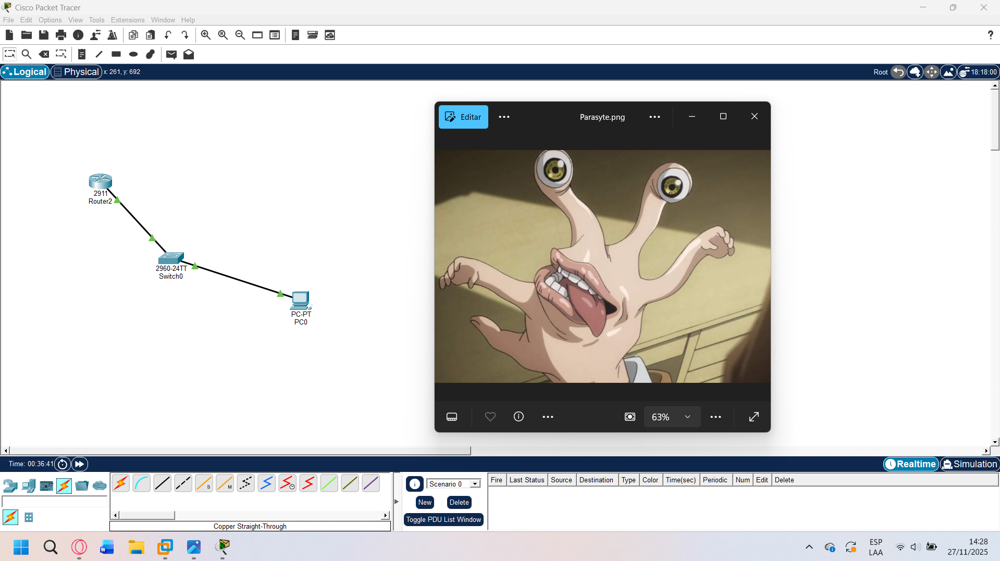

---

## Ítem 3 - Administración de Procesos en Linux

### Listar procesos en ejecución

```bash
ps aux
# Vista compacta de todos los procesos con usuario, PID, CPU y memoria
```

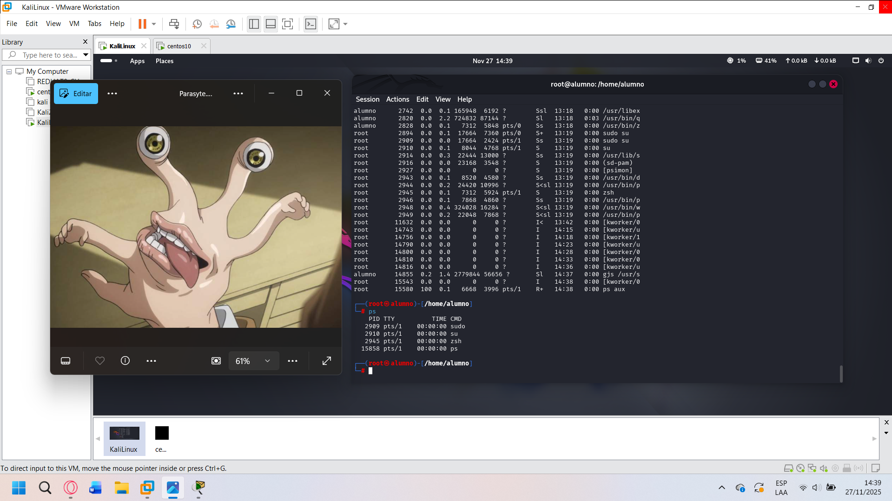

### Identificar un proceso específico y detenerlo

Se usó `top` para identificar el PID del proceso de YouTube en Firefox y luego `kill` para terminarlo.

```bash
# Ver procesos en tiempo real y encontrar PID
top

# Terminar el proceso con PID identificado
kill 18351

# Verificar que el proceso fue terminado
ps aux | grep firefox
```

El proceso de YouTube en Firefox fue identificado con PID `18351` y terminado correctamente.

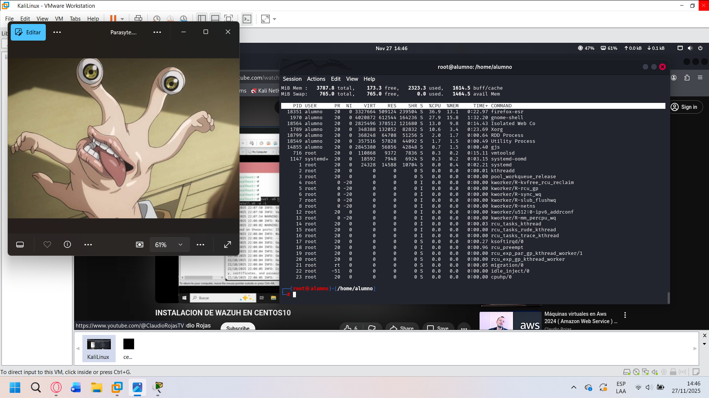
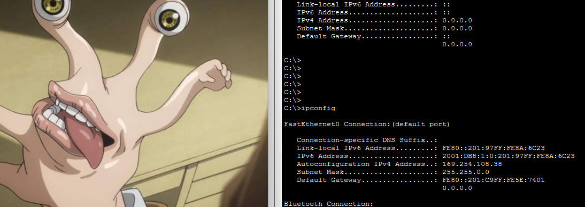

---

## Ítem 4 - Gestión de Permisos en Linux

### Crear archivo y modificar permisos

```bash
# Crear archivo en /home
touch /home/examen.txt

# Verificar permisos actuales
ls -l /home/examen.txt
```

### Configurar permisos: usuario=rwx, grupo=r-x, otros=r--

```bash
chmod 754 /home/examen.txt
ls -l /home/examen.txt
# Salida: -rwxr-xr-- 1 alumno Brothers ...
```

**Desglose del modo 754:**

| Entidad | Permisos | Código |
|---------|----------|--------|
| Usuario (alumno) | rwx - lectura + escritura + ejecución | 7 |
| Grupo (Brothers) | r-x - lectura + ejecución | 5 |
| Otros | r-- - solo lectura | 4 |

Se verificó que otro usuario sin permisos de escritura no podía modificar el archivo.

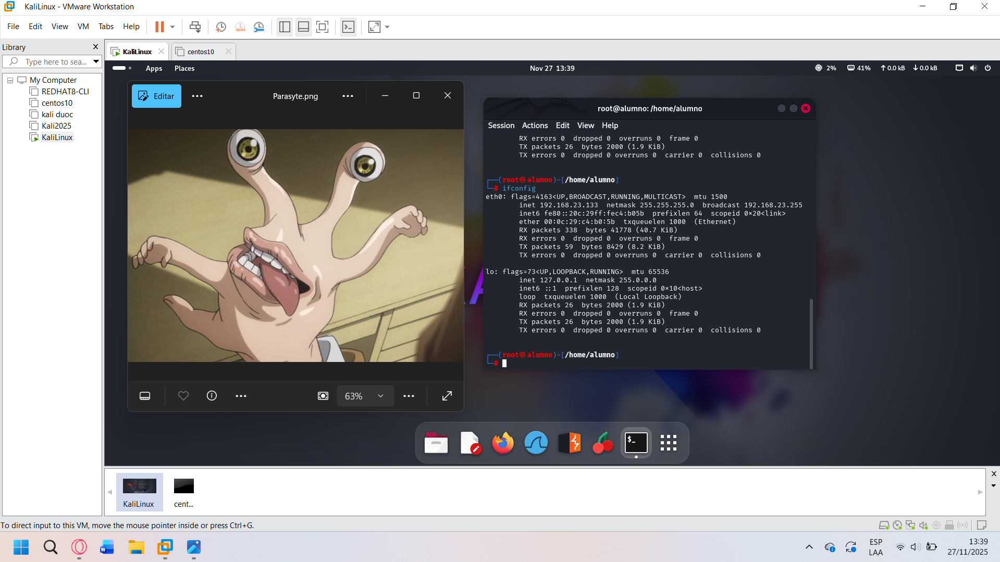

### Crear grupo y usuarios

```bash
# Crear grupo
groupadd Brothers

# Crear usuarios
useradd Larry
useradd Rony

# Agregar usuarios al grupo
usermod -aG Brothers Larry
usermod -aG Brothers Rony

# Cambiar propietario del archivo al grupo
chown alumno:Brothers /home/examen.txt
```

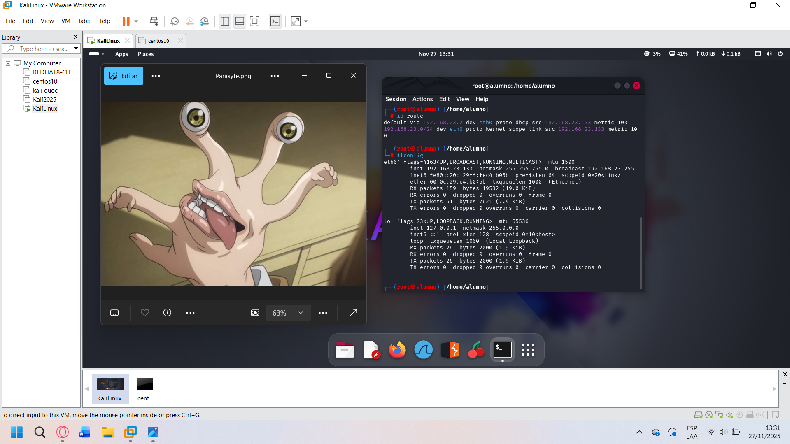

---

## Ítem 5 - Herramientas de Reconocimiento de Red

### Descubrimiento de hosts con Nmap

```bash
# Host discovery en la red 192.168.23.0/24
nmap -sn 192.168.23.0/24

# Guardar resultados en archivo
nmap -sn 192.168.23.0/24 > /escaneo_de_red.txt

# Ver el archivo guardado
cat /escaneo_de_red.txt
```

Se identificaron **5 equipos activos** en la red (4 VMs de VMware + la máquina física).

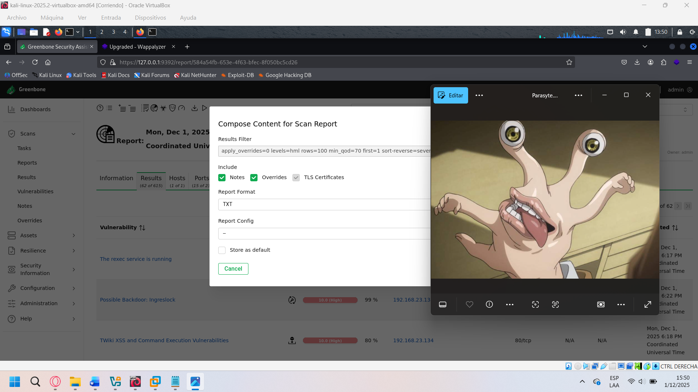
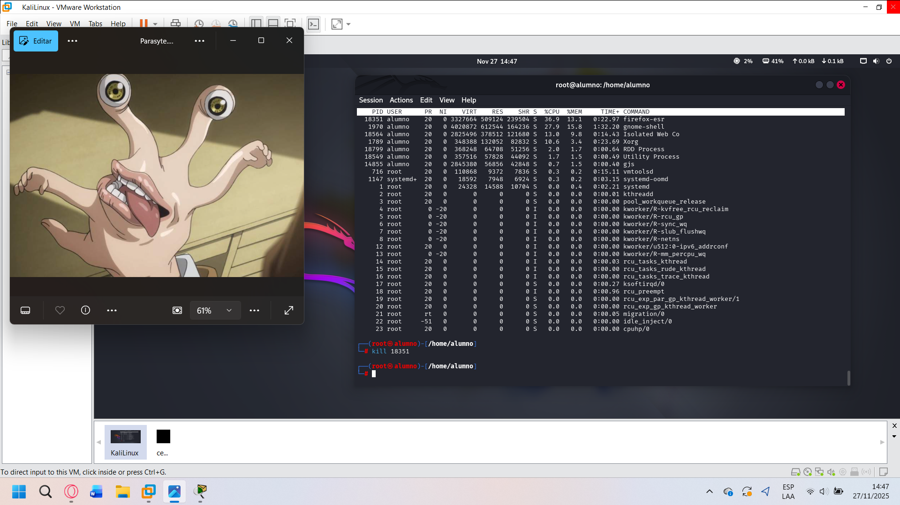

---

## Ítem 6 - Análisis de Resultados del Reconocimiento

Se realizó un escaneo más detallado para obtener servicios y sistema operativo:

```bash
nmap -sV -O 192.168.23.0/24 > /escaneo_de_red.txt
cat /escaneo_de_red.txt
```

### Hallazgos del escaneo

| Equipo | Puerto | Servicio | SO Detectado |
|--------|--------|----------|--------------|
| Host 1 | 53/tcp | DNS | - |
| Host 2 | 22/tcp | SSH | Linux kernel 4.x–5.x |
| Host 3 | 9090/tcp | Cockpit (admin web) | - |
| Hosts VMware | Varios | Servicios VMware internos | Virtualización |

**Análisis:** El equipo con SSH activo en el puerto 22 corresponde al CentOS 10. El servicio en el puerto 9090 es Cockpit, el panel de administración web de CentOS. Los demás dispositivos son parte de la red virtual de VMware.

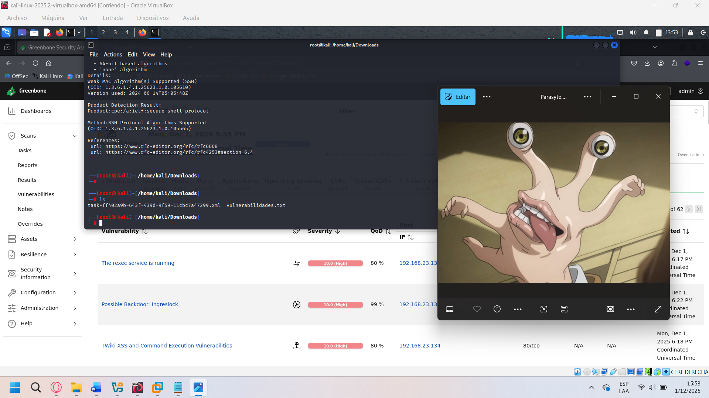

---

## Ítem 7 - Escaneo de Vulnerabilidades

Se utilizó **OpenVAS/Greenbone** (en VirtualBox) para escanear Metasploitable 2 corriendo en VMware.

```bash
# Obtener IP de Metasploitable 2
# (desde la VM Metasploitable)
ifconfig

# Crear tarea en OpenVAS apuntando a la IP de Metasploitable
# → Nueva tarea → Objetivo: [IP de Metasploitable] → Iniciar
```

### Resultado del escaneo
- **Más de 600 vulnerabilidades detectadas**
- Se generó un reporte detallado exportado a `vulnerabilidades.txt`

```bash
# Filtrar resultados críticos
grep -i "vulnerability" vulnerabilidades.txt

# Filtrar por severidad crítica
grep -i "critical" vulnerabilidades.txt
```

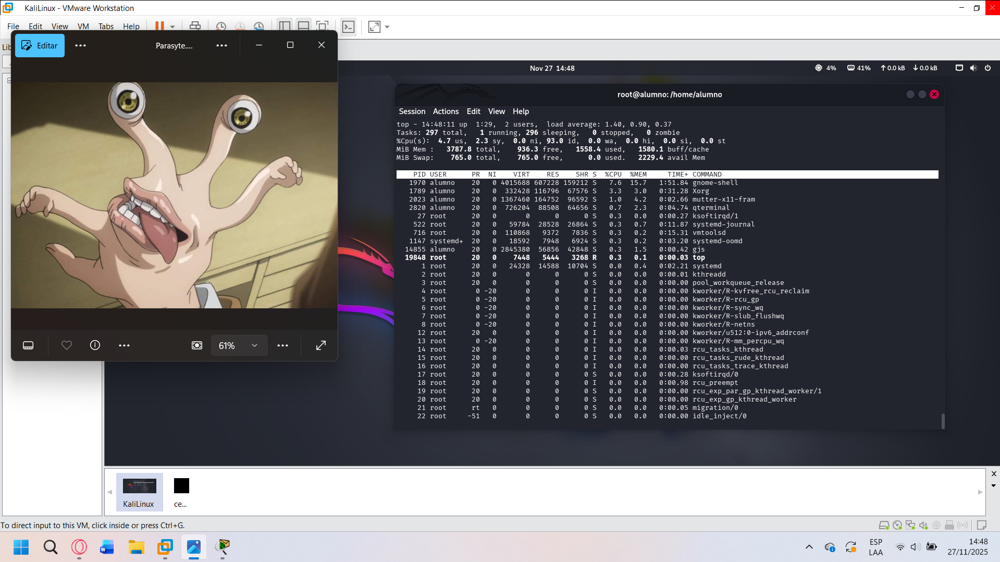
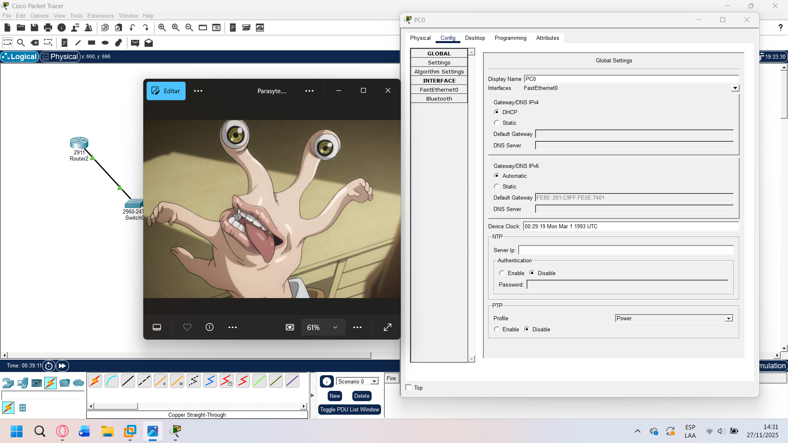
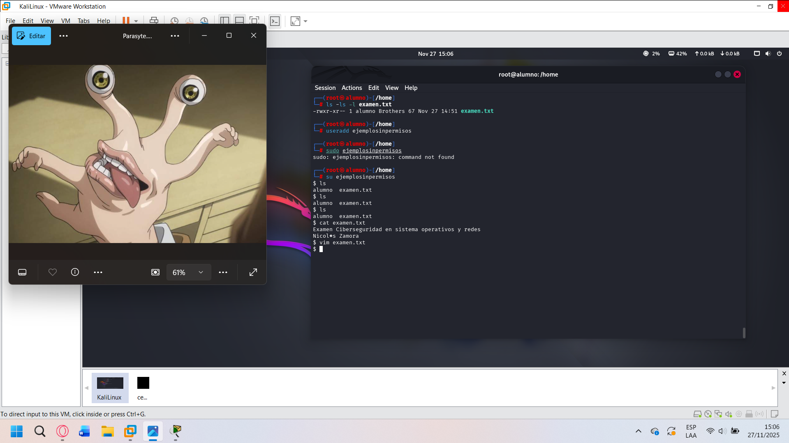

---

## Ítem 8 - Análisis de Vulnerabilidades

### Hallazgos críticos en Metasploitable 2

```bash
grep "vulnerability" vulnerabilidades.txt
```

| Categoría | Vulnerabilidad | Riesgo |
|-----------|---------------|--------|
| Backdoors | Servicios con acceso directo sin autenticación | Crítico |
| RCE | Ejecución remota de código en servicios expuestos | Crítico |
| Protocolos obsoletos | Telnet, rlogin, SSLv2/SSLv3 activos | Alto |
| Web | PUT/DELETE habilitado en HTTP (subir/eliminar archivos) | Alto |
| SSL/TLS | Versiones vulnerables → MitM | Alto |
| Auth | Contraseñas débiles por defecto | Alto |

### Propuesta de mitigación

1. **Actualizar** el sistema operativo y todos los servicios a versiones con parches
2. **Deshabilitar/eliminar** protocolos obsoletos: Telnet, rlogin, SSLv2, SSLv3
3. **Usar solo SSH** para acceso remoto con contraseñas robustas o claves públicas
4. **Configurar firewall** para restringir puertos no necesarios
5. **Hardening de servicios** (Tomcat, VNC, FTP) con configuraciones seguras
6. **Reducir la superficie de ataque:** instalar solo el software necesario
7. **Aplicar controles de acceso** más estrictos (principio de mínimo privilegio)

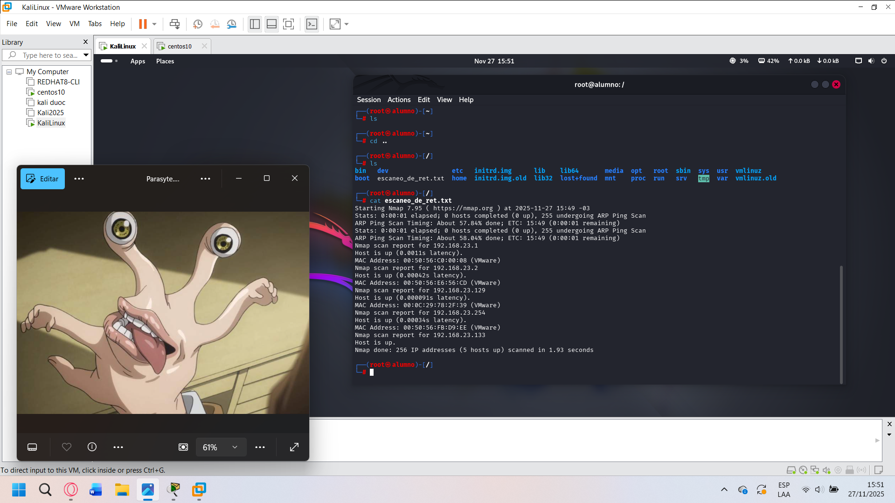
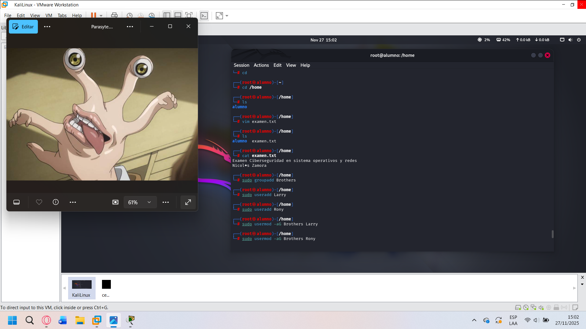

---

## Conclusión

En este trabajo se aplicaron distintos conocimientos fundamentales de redes y sistemas operativos aprendidos durante el semestre:

- Se identificó el **direccionamiento IPv4** y se comprobaron sus parámetros en la red con Kali Linux y CentOS 10.
- Se configuró un entorno **IPv6** en Cisco Packet Tracer, entendiendo la diferencia entre direcciones link-local y unicast global.
- Se practicó la **administración de procesos** en Linux con `ps`, `top` y `kill`, gestionando procesos reales en ejecución.
- Se establecieron **permisos granulares** con chmod 754 y se gestionaron grupos y usuarios.
- Se realizó **reconocimiento de red** con Nmap, identificando todos los hosts activos y sus servicios.
- Se detectaron **más de 600 vulnerabilidades** en Metasploitable 2 con OpenVAS, incluyendo backdoors, RCE y protocolos obsoletos, y se propusieron soluciones concretas de mitigación.

Las vulnerabilidades detectadas en Metasploitable confirman que sistemas sin parches y con servicios obsoletos representan un riesgo crítico. La combinación de Nmap + OpenVAS es una metodología sólida para el reconocimiento y evaluación de seguridad en una red.
