# Informe - Lab 02: Administración Linux, Permisos y Firewall

**Laboratorio 2**  
**Autor:** Nicolás Zamora  
**Fecha:** 15-10-2025

---

## Ejercicio 1 - Creación de Usuarios en Linux

Se crearon 3 usuarios en CentOS 10 con contraseña `hello.136`:

```bash
useradd usuario1
passwd usuario1

useradd usuario2
passwd usuario2

useradd usuario3
passwd usuario3
```

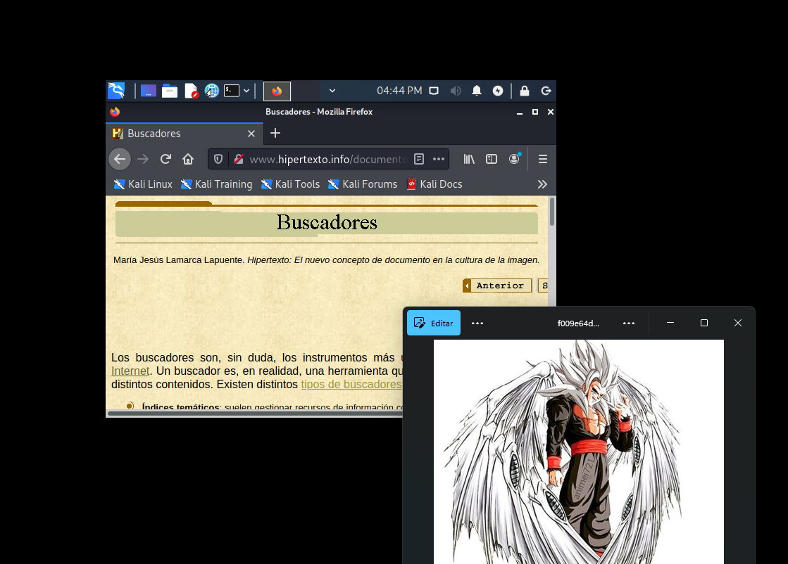

---

## Ejercicio 2 - Creación de Grupo

```bash
groupadd prueba2-nz
```

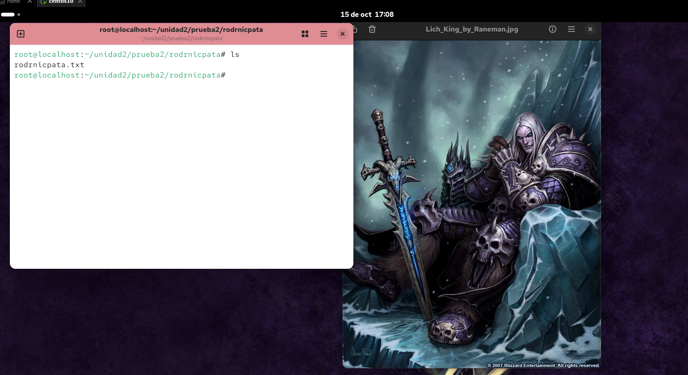

---

## Ejercicio 3 - Creación de Directorio y Archivo

```bash
mkdir -p /unidad2/prueba2/nz/
touch /unidad2/prueba2/nz/nz.txt
```

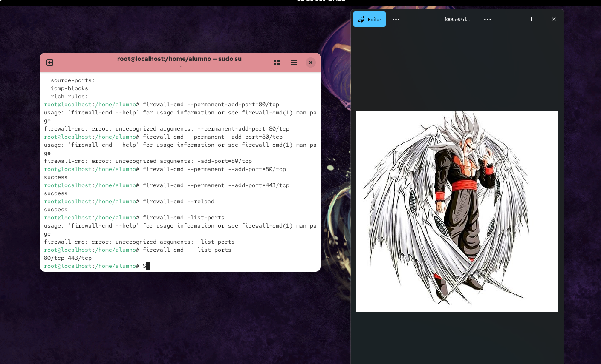

---

## Ejercicio 4 - Permisos del Archivo

Permisos asignados: **usuario: rwx | grupo: r-x | otros: r--** (chmod 754)

```bash
# Asignar permisos
chmod 754 /unidad2/prueba2/nz/nz.txt

# Asignar propietario y grupo dueño
chown usuario1:prueba2-nz /unidad2/prueba2/nz/nz.txt

# Verificar
ls -lah /unidad2/prueba2/nz/nz.txt
# Salida esperada: -rwxr-xr-- 1 usuario1 prueba2-nz ... nz.txt
```

| Entidad | Permisos | Valor |
|---------|----------|-------|
| Usuario (dueño) | rwx - lectura + escritura + ejecución | 7 |
| Grupo | r-x - lectura + ejecución | 5 |
| Otros | r-- - solo lectura | 4 |

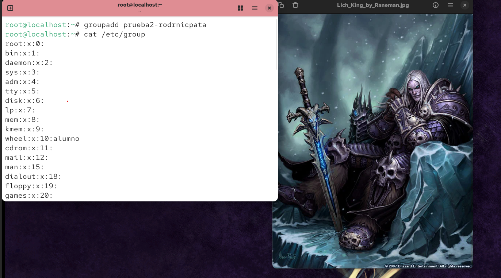

---

## Ejercicio 5 - Procesos con Mayor Uso de Recursos

```bash
top
```

El comando `top` muestra en tiempo real los procesos ordenados por consumo de CPU y memoria, permitiendo identificar cuáles están utilizando más recursos del sistema.

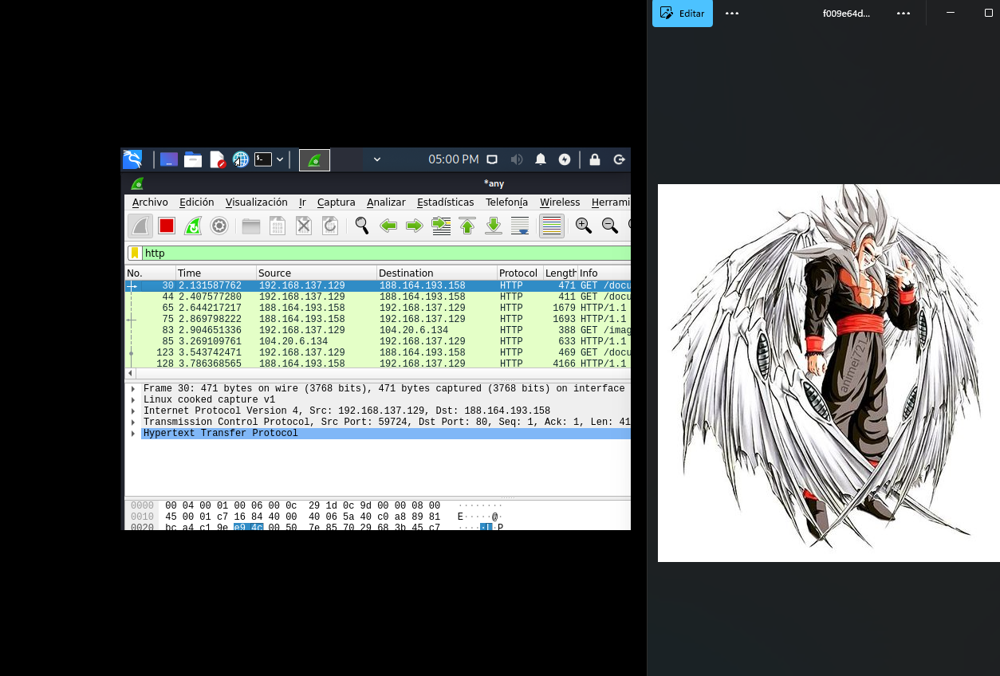

---

## Ejercicio 6 - Configuración de Firewalld (HTTP/HTTPS)

Se configuraron de forma permanente los puertos 80 (HTTP) y 443 (HTTPS) por TCP:

```bash
# Agregar puertos de forma permanente
firewall-cmd --permanent --add-port=80/tcp
firewall-cmd --permanent --add-port=443/tcp

# Aplicar cambios
firewall-cmd --reload

# Verificar estado
firewall-cmd --list-ports
```

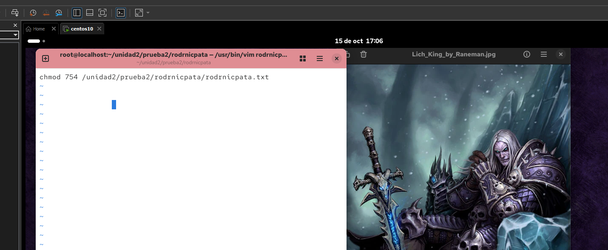


---

## Ejercicio 7 - Configuración de Firewalld (FTP)

Se agregaron los puertos 20 y 21 (FTP) por TCP:

```bash
# Agregar puertos FTP de forma permanente
firewall-cmd --permanent --add-port=20/tcp
firewall-cmd --permanent --add-port=21/tcp

# Aplicar cambios
firewall-cmd --reload

# Verificar estado
firewall-cmd --list-ports
```

**Resultado:** firewalld quedó configurado únicamente con los puertos 80, 443, 20 y 21 por TCP.

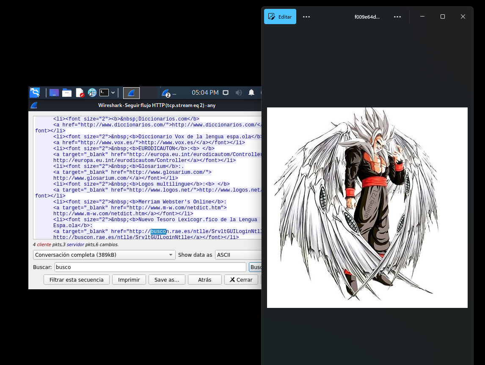
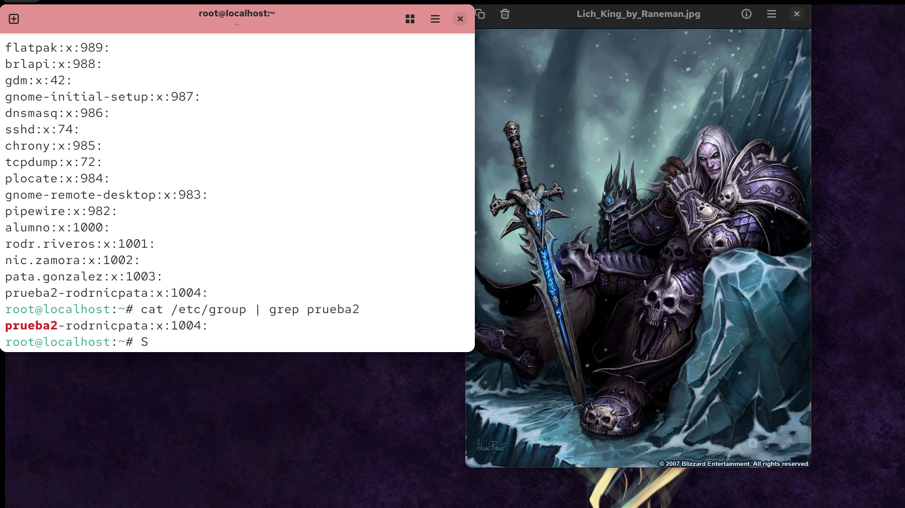

---

## Ejercicio 8 - Captura de Tráfico con Wireshark

Se navegó por un sitio web desde Kali Linux y se capturó el tráfico para identificar una trama específica.

```
Filtro aplicado:
frame contains "palabra_buscada"
```

**Pasos realizados:**
1. Abrir Wireshark en Kali Linux e iniciar captura en la interfaz activa
2. Navegar al sitio web seleccionado
3. Aplicar el filtro `frame contains` con la palabra del sitio
4. Identificar y seguir la trama HTTP capturada

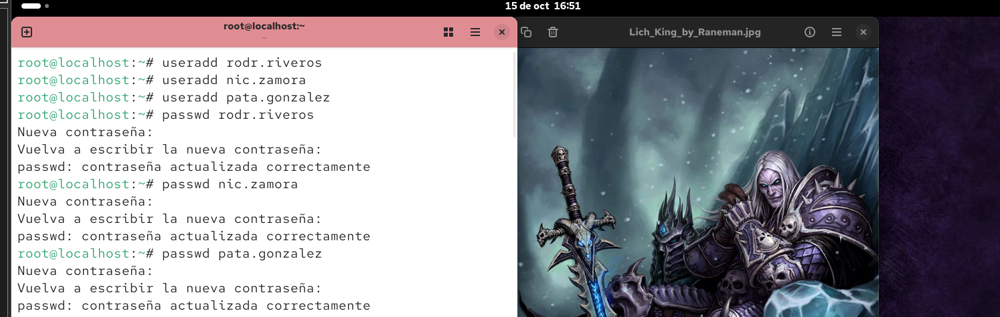
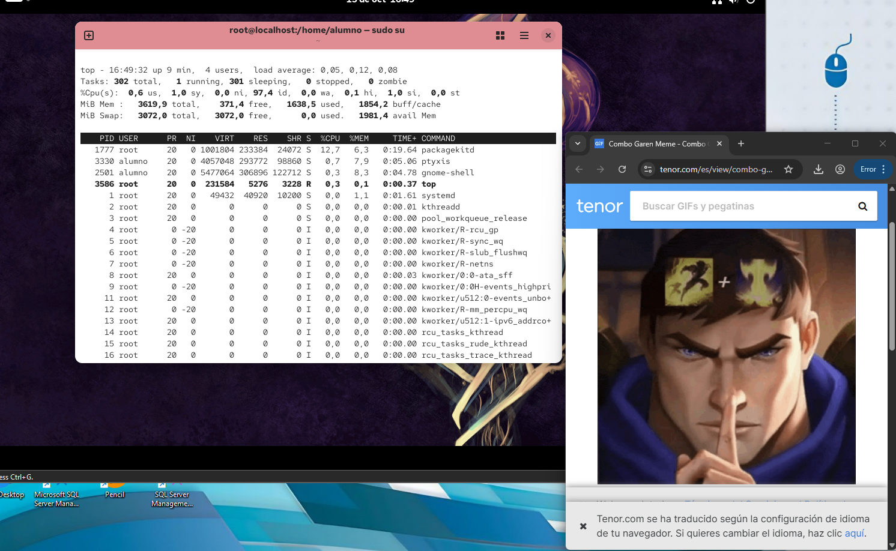
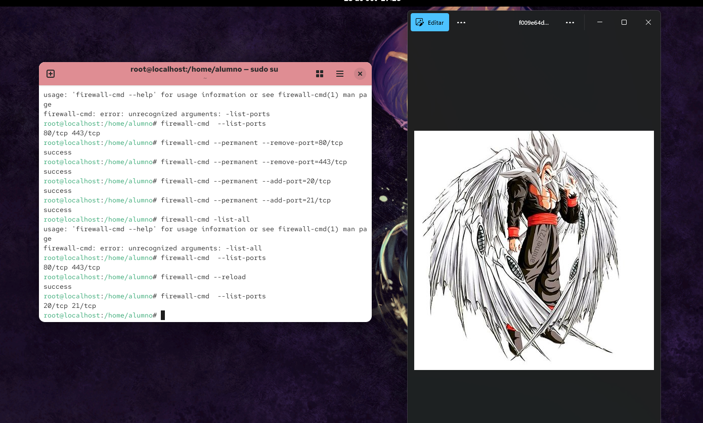
