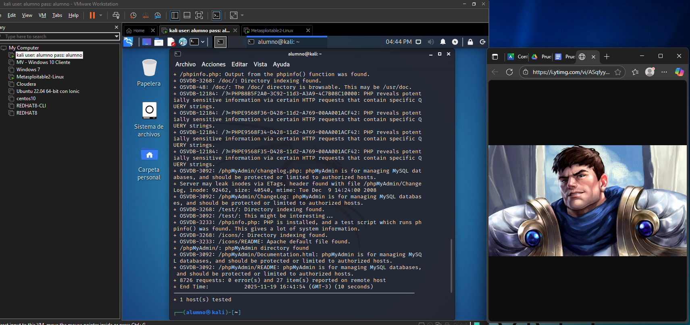
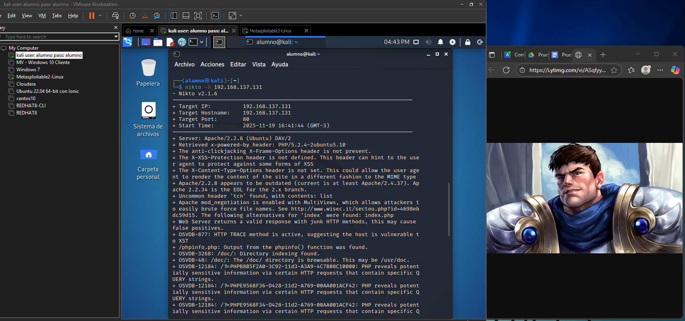
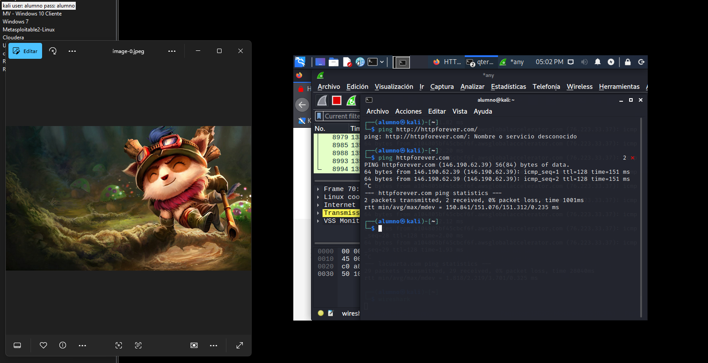
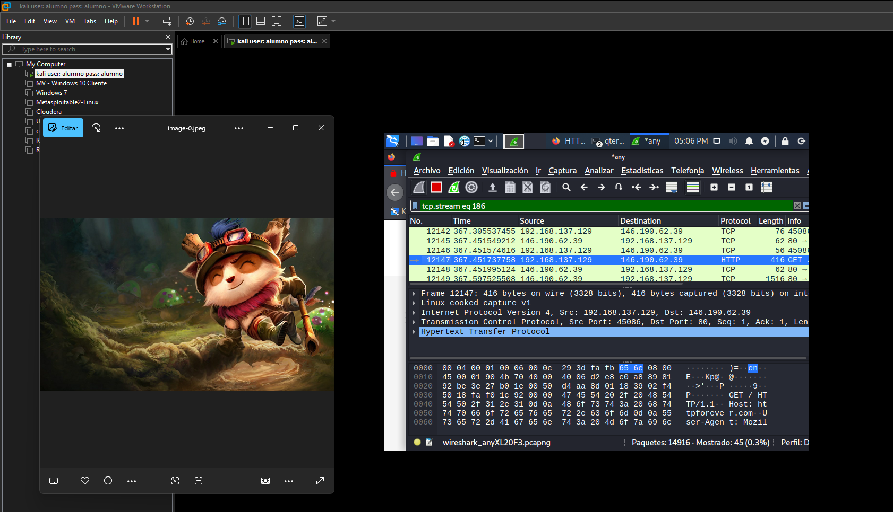
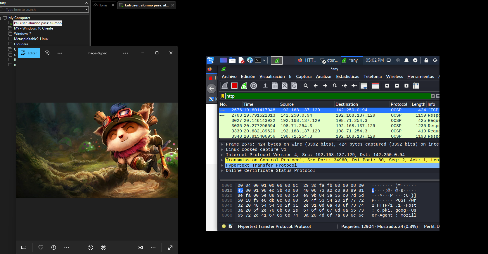
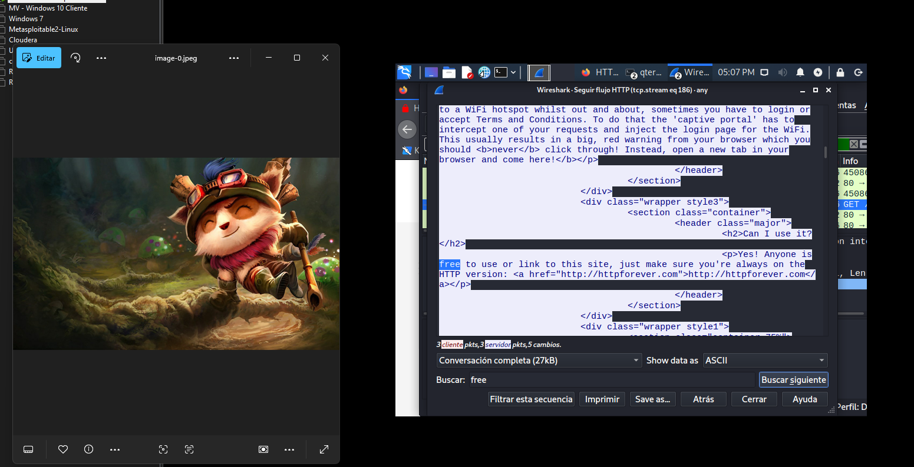
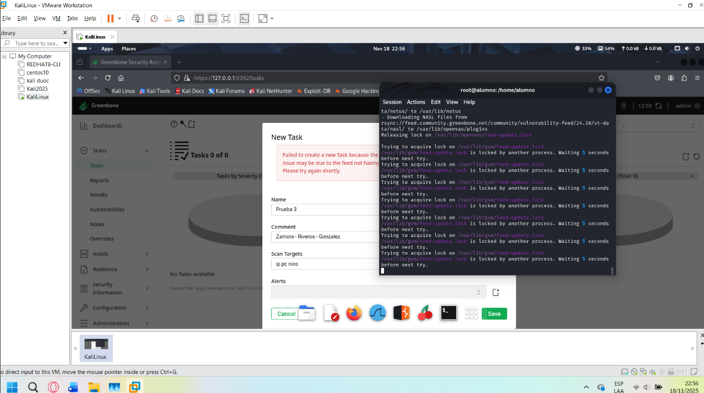
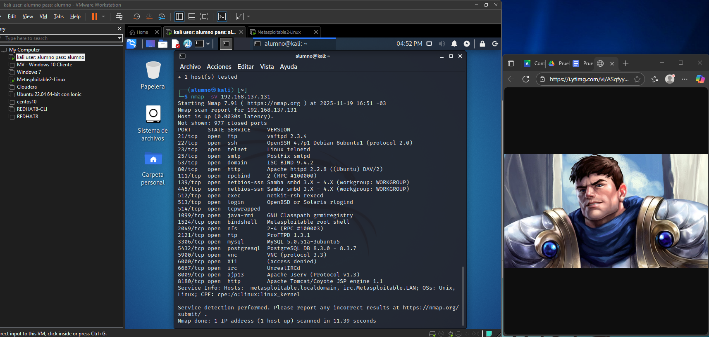
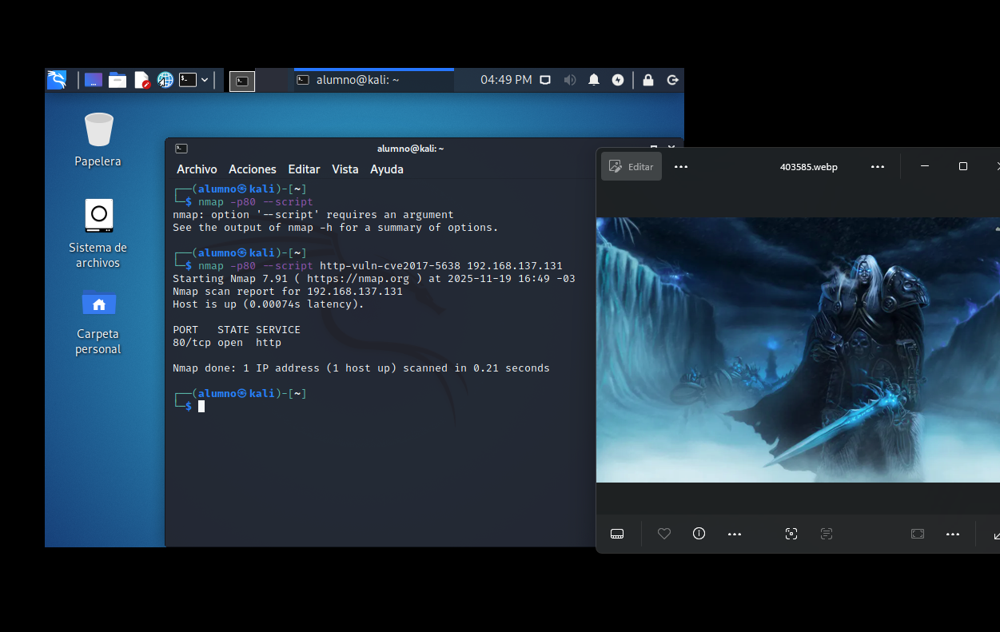

# Informe - Lab 03: Escaneo de Vulnerabilidades, Análisis de Red y Normativas

**Laboratorio 3**  
**Autor:** Nicolás Zamora  
**Fecha:** 19-11-2025

---

## Ejercicio 1 - Reporte de Vulnerabilidades con OpenVAS

Se instaló OpenVAS/Greenbone en la máquina virtual y se generó un reporte de vulnerabilidades.

**Resultado:** El programa se instaló correctamente. Al generar el informe se produjo un error por falta de sincronización de paquetes, sin embargo la interfaz de OpenVAS quedó operativa y analizando vulnerabilidades.

**Descripción de una vulnerabilidad identificada:**  
OpenVAS detecta vulnerabilidades clasificándolas por severidad (crítica, alta, media, baja). Cada entrada incluye el CVE asociado, descripción del vector de ataque, sistema afectado y recomendación de mitigación. Las vulnerabilidades críticas corresponden a servicios expuestos con exploits públicos disponibles.




---

## Ejercicio 2 - Nmap: Identificación de CVE-2017-5638

La vulnerabilidad **CVE-2017-5638** es una falla crítica de ejecución remota de código (RCE) en Apache Struts 2, explotada en la brecha de datos de Equifax (2017). Permite a un atacante ejecutar comandos arbitrarios en el servidor mediante una cabecera HTTP manipulada.

```bash
nmap --script http-vuln-cve2017-5638 -p 80 <IP_objetivo>
```



---

## Ejercicio 3 - Nmap: Puertos Abiertos en Metasploitable

Se escanearon los puertos abiertos de Metasploitable 2 con detección de versión de servicios:

```bash
nmap -sV <IP_metasploitable>
```

**Servicios identificados (muestra):**

| Puerto | Servicio | Versión |
|--------|----------|---------|
| 21/tcp | FTP | vsftpd 2.3.4 |
| 22/tcp | SSH | OpenSSH 4.7p1 |
| 23/tcp | Telnet | Linux telnetd |
| 80/tcp | HTTP | Apache httpd 2.2.8 |
| 3306/tcp | MySQL | MySQL 5.0.51a |



---

## Ejercicio 4 - Wireshark: Captura de Tráfico HTTP

Se capturó tráfico mientras se navegaba por `httpforever.com` (IP: `146.190.62.39`).

```bash
# Verificar IP del sitio
ping httpforever.com
```

**Pasos realizados en Wireshark:**
1. Iniciar captura en la interfaz activa
2. Navegar al sitio HTTP
3. Aplicar filtro para mostrar solo tráfico HTTP: `http`
4. Seguir la trama (`Follow > HTTP Stream`) para ver el flujo completo de datos
5. Aplicar filtro adicional con palabra clave para mayor precisión

**Resultado:** Se identificaron los paquetes HTTP en texto plano, incluyendo cabeceras y contenido de la respuesta del servidor.





---

## Ejercicio 5 - Nikto: Análisis de la Página por Defecto de Metasploitable

```bash
nikto -h http://<IP_metasploitable>
```

**Resultados obtenidos:**
- Servidor web identificado: Apache 2.2.8
- Directorio `/phpMyAdmin/` expuesto sin autenticación
- Archivos de configuración accesibles públicamente
- Versiones desactualizadas con CVEs conocidos
- Cabeceras de seguridad HTTP ausentes (X-Frame-Options, X-XSS-Protection)



---

## Ejercicio 6 - Triada CIA de Seguridad

**C - Confidencialidad:** Evita que personas no autorizadas accedan a la información. Ejemplo: cifrado de datos y control de contraseñas.

**I - Integridad:** Garantiza que los datos no sean modificados sin autorización. Ejemplo: firmas digitales y hashes de verificación.

**D - Disponibilidad:** Asegura que la información esté accesible cuando se necesite. Ejemplo: mitigación de ataques DoS y sistemas de redundancia.



---

## Ejercicio 7 - Normativa PCI DSS

**PCI DSS (Payment Card Industry Data Security Standard)** es un conjunto de requisitos de seguridad diseñados para proteger los datos de tarjetas de pago. Su objetivo es prevenir fraudes y robos de información financiera, exigiendo que las empresas que procesan, almacenan o transmiten datos de tarjetas cumplan con controles estrictos de seguridad como cifrado, control de acceso, monitoreo y pruebas regulares de seguridad.

---

## Ejercicio 8 - Ley 21.459 (Chile)

La **Ley 21.459** sobre delitos informáticos en Chile sanciona:

- Acceso indebido a sistemas informáticos
- Interceptación de comunicaciones sin autorización
- Daño informático (eliminación, alteración o destrucción de datos)
- Ataques con ransomware, malware y phishing
- Fraude informático
- Sabotaje de infraestructura crítica
